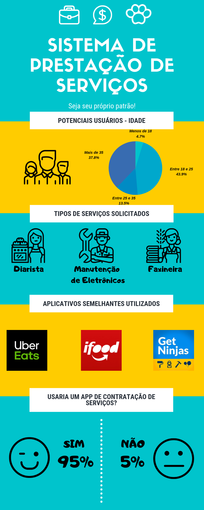

# Análise do Questionário

## Histórico de Revisões

|    Data    | Versão |                Descrição                 |   Autor(es)   |
| :--------: | :----: | :--------------------------------------: | :-----------: |
| 22/08/2019 |  1.0   | Adicionado V1 da documentação de análise do questionário|  Matheus Pimenta  |

## Metodologia
Para que a ideia do projeto tivesse uma validação com os usuários, foi feito uma pesquisa psobre o tema. 
Obtivemos **148** respostas de pessoas acima de 18 anos. O questionário foi feito pelo *Google Forms* e as perguntas feitas e validadas por toda a equipe.
Como haviam algumas perguntas discursivas relacionada às opniões dos respondentes, achamos conveniente usar algumas ferramentas de análise textual para que, assim, conseguíssemos obter as principais temáticas das respostas.

## Resultados

### Utilização Prévia de Algum Aplicativo Fornecedor de Serviços

Com as respostas foi gerado uma nuvem de palavras de todas as respostas:

Aprofudando a análise, constatou-se que:
* Grande parte utiliza serviços como *Uber* e *iFood*
* Os principais pontos positivos são: 
  * Praticidade, 
  * Qualidade do serviço oferecido
  * Comodidade
* Já os principais pontos negativos levantados foram:
  * Falta de segurança no prestador de serviços
  * Demora de entrega
  * Atendimento recebido

### Serviços que Contratariam
Dentre todos os serviços possíveis, os mais requeridos foram: **Diarista** e **Manutenção de Aparelhos Eletrônicos**, como pode ser visto na imagem abaixo:

### Funcionalidades do Aplicativo
Na questão que pediu ao respondente descrever quais funcionalidades seriam mais requeridas em um aplicativo de contração de serviços, foram feitas duas análises: uma nuvem de palavras, para verificar a ocorrências dos principais termos, e uma *Modelagem de Tópicos*, para analisar, dentre todas as respostas, quais eram os principais temas comentados. E os resultados foram:

#### Nuvem de Palavras

#### Modelagem de Tópicos

Os principais pontos levantados foram:
* Sistema de avaliação dos prestadores/serviços prestados
* Diversas formas de pagamento
* Acesso aos antecedentes criminais dos prestadores de serviço
* Ter a opção no app de haver "usuários verificados", que passaria mais segurança ao usuário
* Sistema de recomendação
* Galeria de fotos dos trabalhos realizados
* Sincronização com outras plataformas
* Disponibilização da cobertura geográfica do atendimento de cada prestador

