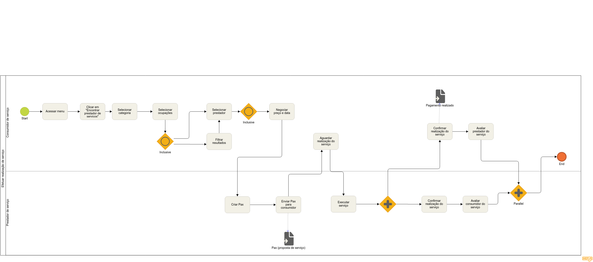

# Modelagem de Metodologias

## Descrição

Para realizar a disciplina de *Arquitetura e Desenho de Software* foi decidido realizar a modelagem *BPMN* considerando toda a disciplina e seus entregáveis intermediários. Para isso foi modelado usando o software **Bizagi** seguindo os padrões *BPMN*. Como o projeto está em suas fases iniciais, algumas etapas não foram desenvolvidas por falta de conhecimento da equipe mediante etapas posteriores da disciplina, porém as mesmas serão desenvolvidas antes da etapa ocorrer.

## Histórico de Revisões

|    Data    | Versão |      Descrição       |                  Autor(es)                   |
| :--------: | :----: | :------------------: | :------------------------------------------: |
| 06/09/2019 |  0.1   | Criação do documento | Fabiana Pfeilsticker Ribas e Matheus Pimenta |
| 06/09/2019 |  1.0   | Adição dos diagramas | Matheus Pimenta e Fabiana Pfeilsticker Ribas |
| 06/09/2019 |  1.1   | Colocando autores    | Rogério Júnior                               |
| 05/09/2019 |  1.2   | Adição da V2 do fluxo - usando notação BPMN | Kaique Borges  |

## Versões 1.0

### Modelagem Geral - PAX

Autores: [Fabiana Ribas](https://github.com/FabianaRibas) e [Matheus Figueiredo](https://github.com/Matheusss03)

### Processo - Elaboração Inicial de Artefatos

Autores: [Fabiana Ribas](https://github.com/FabianaRibas) e [Matheus Figueiredo](https://github.com/Matheusss03)

### Subprocesso - Definição de Projeto

Autores: [Fabiana Ribas](https://github.com/FabianaRibas) e [Matheus Figueiredo](https://github.com/Matheusss03)

### Processo - Definição de Metodologias e Abordagens

Autores: [Fabiana Ribas](https://github.com/FabianaRibas) e [Matheus Figueiredo](https://github.com/Matheusss03)

### Subprocesso - Metodologia de Desenvolvimento

Autores: [Fabiana Ribas](https://github.com/FabianaRibas) e [Matheus Figueiredo](https://github.com/Matheusss03)

### Subprocesso - Planejamento da Sprint

Autores: [Fabiana Ribas](https://github.com/FabianaRibas) e [Matheus Figueiredo](https://github.com/Matheusss03)

### Subprocesso - Retrospectiva da Sprint

Autores: [Fabiana Ribas](https://github.com/FabianaRibas) e [Matheus Figueiredo](https://github.com/Matheusss03)

### Suprocesso - Review da Sprint

Autores: [Fabiana Ribas](https://github.com/FabianaRibas) e [Matheus Figueiredo](https://github.com/Matheusss03)

### User flow:
É um gráfico que representa os fluxos de interações que um usuário executa em uma aplicação. É utilizado para documentar e mapear as interações com o produto com o intuito analisá-las e melhorá-las, para que o usuário tenha a melhor experiência possível com o app. Baseados nos artefatos de elicitação (entrevistas, resultados do questionário, etc.) um fluxo de uso da aplicação foi criado seguindo a notação [BPMN](https://pt.wikipedia.org/wiki/Business_Process_Model_and_Notation). A intenção aqui é ilustrar graficamente a navegação no aplicativo para facilitar na concepção e criação das telas do MVP.

## Referências

- 