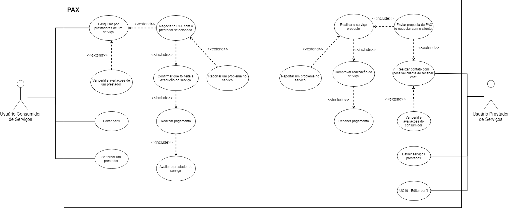
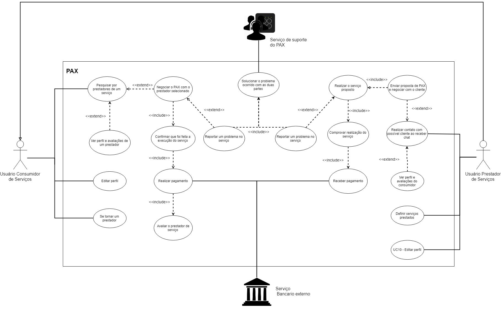
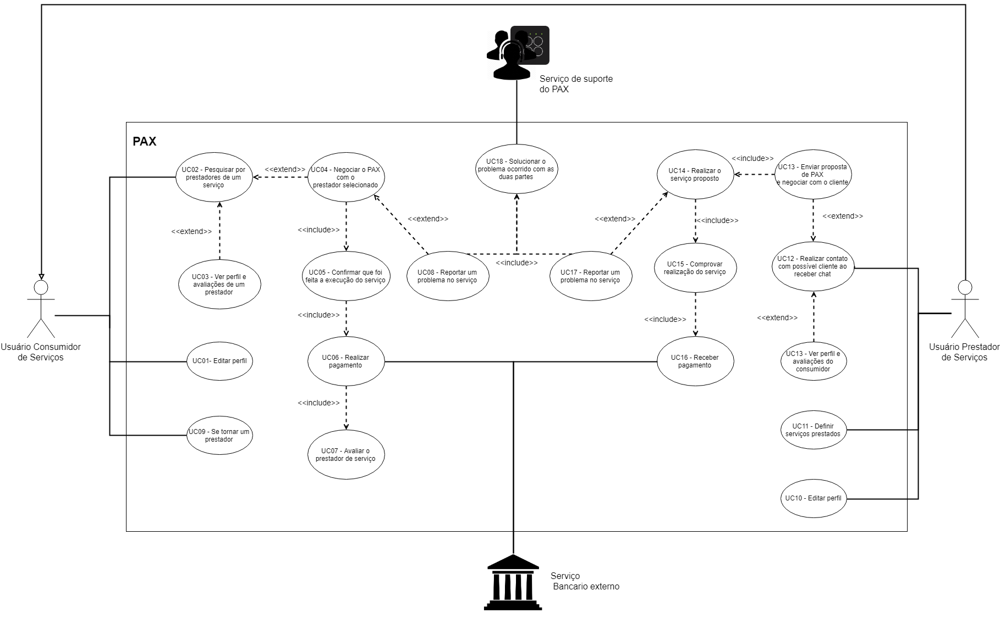

# Diagrama de Casos de Uso

Abaixo segue o diagrama com os casos de uso da aplicação, visando expor alguns dos requisitos funcionais da aplicação através do fluxo de eventos no qual elas se encontram e a qual ator elas pertencem. Dessa forma, por meio deste diagrama é possível enxergar o sistema através das relações entre seus atores e as possíveis ações de cada um deles.

## Histórico de Revisões

| Data | Versão | Descrição | Autor(es) |
| :--: | :----: | :-------: | :-------: |
| 18/09/2017     |  1.0       |  Criação do documento         |      Marcos Nery    |
| 18/09/2017     |  1.1       |  Adição de novas versões do diagrama       |      Marcos Nery    |

### Descrição dos atores envolvidos

#### Usuário consumidor de serviços

Como definido no Léxico [L3](docs/DS/dinamica-e-seminario-2/lexico.md#L3), é o usuário que utiliza o aplicativo com a finalidade de consumir algum dos serviços gerais oferecidos.

#### Usuário prestador de serviços

Como definido no Léxico [L2](docs/DS/dinamica-e-seminario-2/lexico.md#L2), é o usuário que utiliza o aplicativo com a finalidade de se colocar a disposição para ser contratado para realizar algum serviço.

#### Serviço de Suporte do PAX 

&emsp;&emsp;Equipe interna responsável por prestar suporte aos usuários do aplicativo solucionando problemas que possam aparecer durante a realização de um serviço. Sendo estes portanto os responsáveis por tomar medidas mediante a reclamações feitas por usuários acerca de inconvenientes de quaisquer categorias dentro do fluxo da prestação/contratação de um serviço.

#### Serviço bancário externo

&emsp;&emsp;Organizações bancarias responsáveis pelo processamento dos pagamentos feitos pelo aplicativo.

### DCU-V1
Primeira versão do diagrama

**Autor:** [Marcos Nery](https://github.com/marcosnbj)

### DCU-V2
Adição de relação entre usuário prestador e usuário consumidor e de outros dois atores do sistema, além de um outro caso de uso.

**Autor:** [Marcos Nery](https://github.com/marcosnbj)

### DCU-V3
Numeração dos casos de uso.

**Autor:** [Marcos Nery](https://github.com/marcosnbj)

## Referências

* UML Use Case Diagrams. Acessado em 15/09/2019. Em: https://www.uml-diagrams.org/use-case-diagrams.html