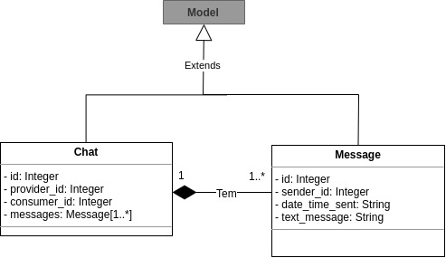
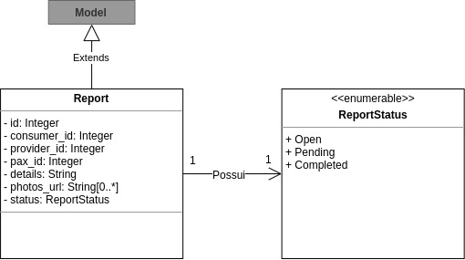
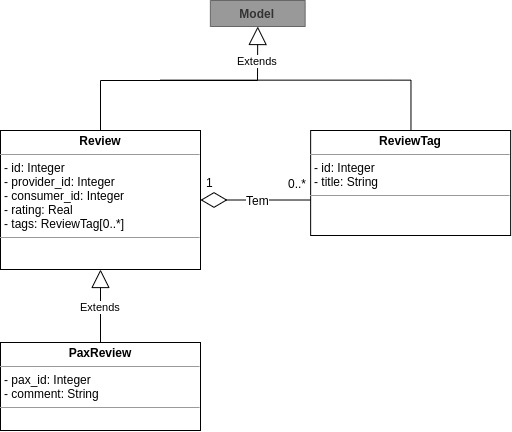
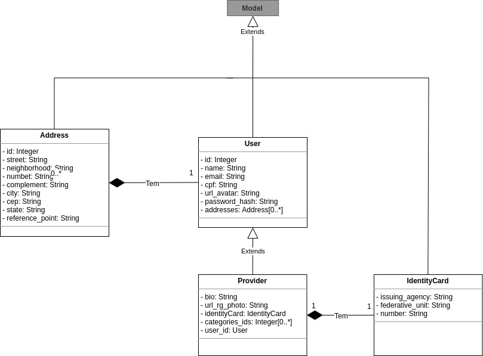
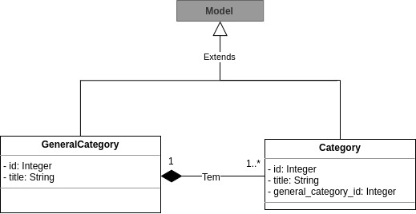

# Diagrama de Classes

Na Programação Orientada a Objetos, classes são fundamentais para a execução do paradigma. A UML criou o Diagrama de Classes para facilitar a compreensão e desenho do software, mostrando as suas propriedades, métodos e relacionamentos.

## Histórico de Revisões

|    Data    | Versão |             Descrição             |   Autor(es)   |
| :--------: | :----: | :-------------------------------: | :-----------: |
| 16/09/2017 |  1.0   | Adição da v0 do diagrama Back-end | Kaique Borges |
| 22/09/2019 |  1.1   |         Formatando referências ABNT         |                 Rogério Júnior               |

## Back-end

O back-end será construído por serviços feitos com o microframework Flask em Python juntamente com serviços feitos com Express em NodeJs. Cada um dos microsserviços tem um diagrama correspondente.

### Pax v1

### Chat v1

### Reports v1

### Reviews v1

### User v1

### Category v1

**Autor:** [Kaique Borges](https://github.com/kaiqueborges)

## Referências

- DEVMEDIA. **Orientações básicas na elaboração de um diagrama de classes**. [S. l.], 2019. Disponível em: https://www.devmedia.com.br/orientacoes-basicas-na-elaboracao-de-um-diagrama-de-classes/37224. Acesso em: 16 set. 2019.
