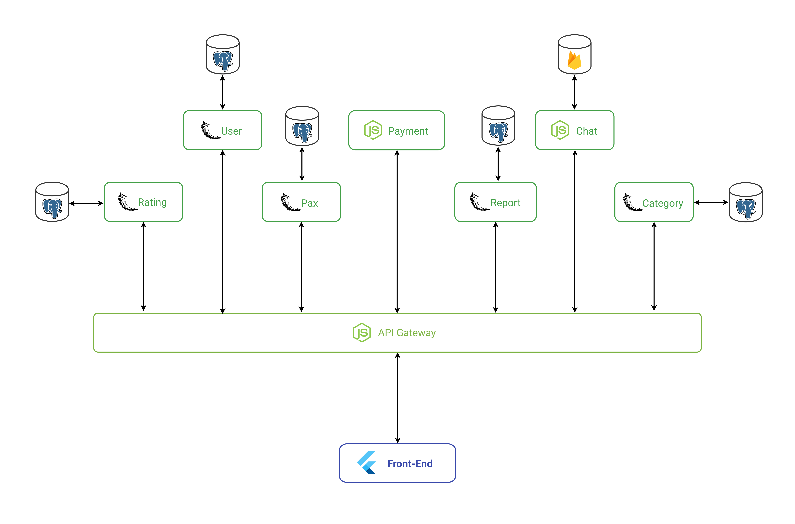

# Diagrama de Contexto

Diagrama de contexto é uma ferramenta para modelar o escopo através de um diagrama.
Em desenvolvimento de sistemas, ele é considerado o diagrama de fluxo de dados de maior nível, isto é, um diagrama que representa todo o sistema. Além disso, ele demonstra como as partes interessadas e outras entidades interagem com o sistema indicando suas entradas e saídas.

## Histórico de Revisões

| Data | Versão | Descrição | Autor(es) |
| :--: | :----: | :-------: | :-------: |
|  22/09/2019    |    1.0    |   Criação do documento        |    Ésio Freitas       |

## Diagrama de contexto V1

**Autor:** [Lucas Dutra](https://github.com/lucasdutraf).

## Diagrama de contexto V2

**Autor:** [Lucas Dutra](https://github.com/lucasdutraf).

## Referências

- Diagrama de contexto. Acessado 22/09/2019. Em <https://escritoriodeprojetos.com.br/diagrama-de-contexto>