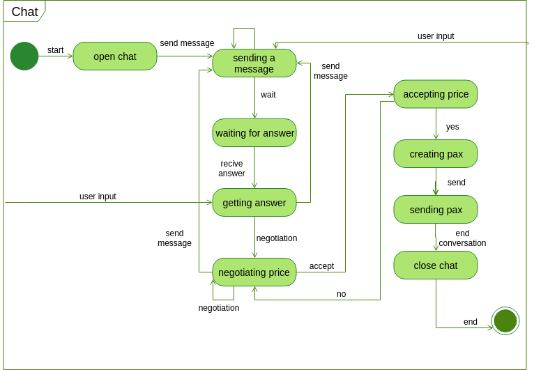
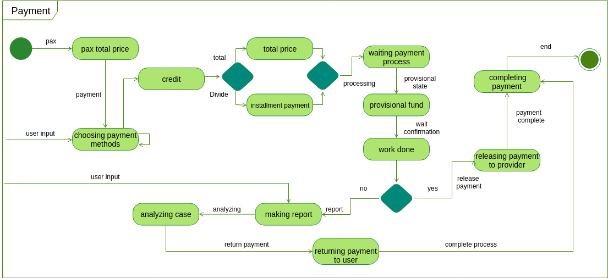

# Diagrama de Estados

Diagrama de estado é definido como um diagrama que descreve os eventos do comportamento de um sistema. Diagramas de estado são utilizadas especificamente para definir o comportamento dependente do estado ou o comportamento que varia de acordo com o estado em que está o elemento do modelo.

Por ser um diagrama que descreve os diversos estados que algumas partes do sistema podem assumir, a equipe optou por fazer os diagramas de estados do sistema de chat e do pagamento, onde haverá maior mudança de estados.

## Histórico de Revisões

| Data | Versão | Descrição | Autor(es) |
| :--: | :----: | :-------: | :-------: |
|   16/09/2019   |    1.0    |   Criação da pagina        |    Fabiana Luiza Vasconcelos Pfeilsticker Ribas       |
|   16/09/2019   |    1.1    |   Adicionando textos        |    Fabiana Luiza Vasconcelos Pfeilsticker Ribas       |
|   16/09/2019   |    1.2    |   Adicionando diagramas v1.0        |    Fabiana Luiza Vasconcelos Pfeilsticker Ribas       |
|   19/09/2019   |    1.3    |   Atualizando diagrama chat v2.0        |    Fabiana Luiza Vasconcelos Pfeilsticker Ribas       |
|   19/09/2019   |    1.4    |   Atualizando diagrama payment v2.0        |    Fabiana Luiza Vasconcelos Pfeilsticker Ribas       |
|   19/09/2019   |    1.5    |   Revisão de texto        |    Fabiana Luiza Vasconcelos Pfeilsticker Ribas       |
| 22/09/2019 |  1.6   |         Formatando referências ABNT         |                 Rogério Júnior               |

## Diagramas

Os diagramas de estados do módulo de chat e do módulo de pagamento foram feitas a partir do [Backlog](docs/DS/dinamica-e-seminario-2/Backlog.md) definido. Segue abaixo os diagramas de estados do chat e do pagamento:

### Versão 2.0

**Autor:** [Fabiana Ribas](https://github.com/FabianaRibas)

### Versão 2.0

**Autor:** [Fabiana Ribas](https://github.com/FabianaRibas)

### Versão 1.0

**Autor:** [Fabiana Ribas](https://github.com/FabianaRibas)

### Versão 1.0

**Autor:** [Fabiana Ribas](https://github.com/FabianaRibas)

## Referências

- IBM. **Diagrama de Estados**. [S. l.], 2006. Disponível em: http://mds.cultura.gov.br/core.base_rup/guidances/guidelines/statechart_diagram_640B5D0B.html. Acesso em: 13 set. 2019.

- UML. **State Machine Diagrams**. [S. l.], 2019. Disponível em: https://www.uml-diagrams.org/state-machine-diagrams.html. Acesso em: 13 set. 2019.