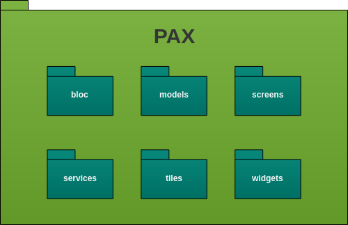

# Diagrama de Pacotes

Nos últimos tempos, surgem sistemas cada vez mais complexos, com estruturas de classes imensas e arquiteturas de camadas muito divididas. Para evitar com que o software se torne tão complexo ao ponto de se perder o “controle”, houve-se a necessidade de quebrar um grande complexo em menores partes de menor complexidade, principalmente para um entendimento mais fácil de quem irá desenvolver e dar manutenção nessas aplicações. Uma das formas eh por diagrama de pecotes que têm como conceito agrupadores lógicos de pedaços dos sistemas (nível superior) com dependência entre eles (interação de pacotes), ou seja, pacotes podem depender de outros pacotes

## Histórico de Revisões

| Data | Versão | Descrição | Autor(es) |
| :--: | :----: | :-------: | :-------: |
| 12/09/2017     |  1.0       |  Criação do documento         |      Ésio Freitas     |

## Front-end

O front-end será inteiramente construído com a framework Flutter em Dart. Segue a estrutura de pacotes da aplicação:

**Autor:** [Esio Gustavo](https://github.com/EsioFreitas)

## Back-end

O back-end será construído por serviços feitos com o microframework Flask em Python juntamente com serviços feitos com Express em NodeJs. Segue a estrutura de pacotes da aplicação:

**Autor:** [Esio Gustavo](https://github.com/EsioFreitas)

## Referências

- Diagramas Estruturais da UML: Diagrama de Pacotes. Acessado em 12/09/2019. Em: <http://micreiros.com/diagrama-de-pacotes/>

- Diagrama de Pacotes. Acessado em 12/09/2019. Em: <https://homepages.dcc.ufmg.br/~amendes/GlossarioUML/glossario/conteudo/pacotes/diagrama_de_pacotes.htm>  
