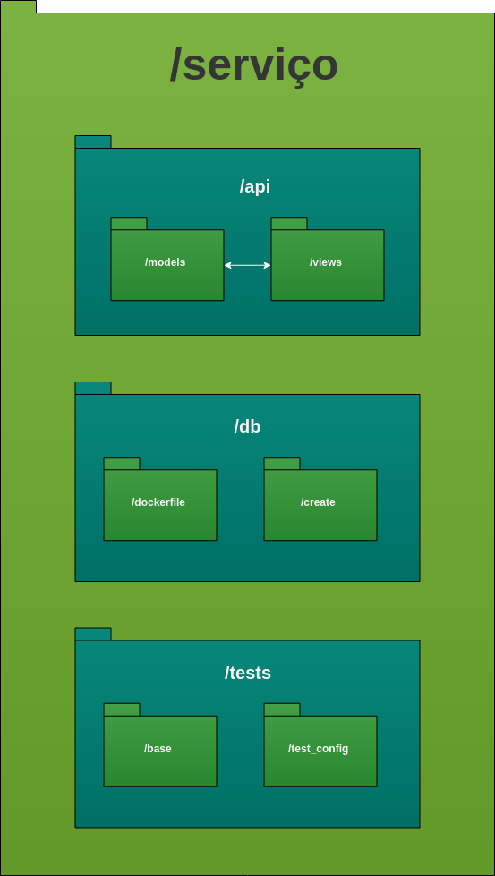
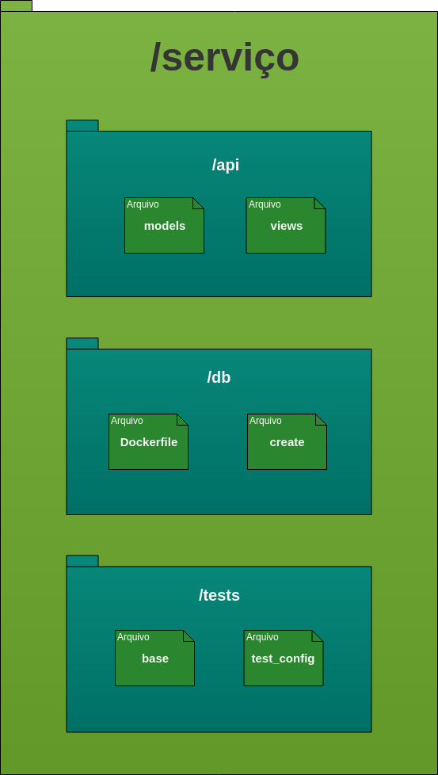
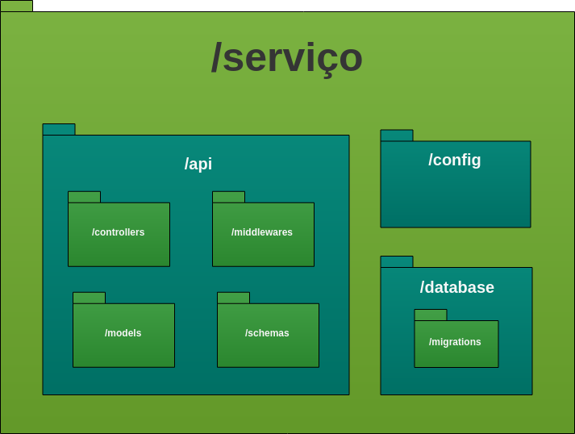
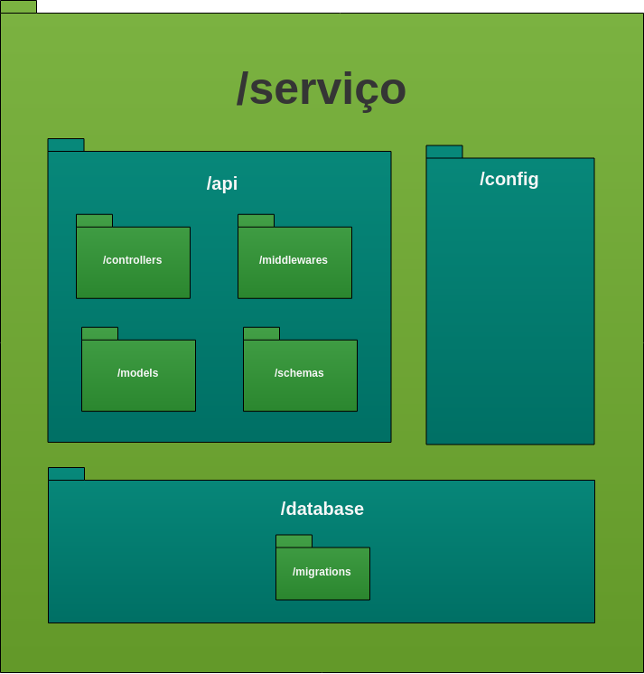

# Diagrama de Pacotes

Nos últimos tempos, surgem sistemas cada vez mais complexos, com estruturas de classes imensas e arquiteturas de camadas muito divididas. Para evitar com que o software se torne tão complexo ao ponto de se perder o “controle”, houve-se a necessidade de quebrar um grande complexo projeto em menores partes de menor complexidade, principalmente para um entendimento mais fácil de quem irá desenvolver e dar manutenção. Uma das formas é por diagrama de pecotes que têm como conceito agrupadores lógicos de pedaços dos sistemas (nível superior) com dependência entre eles (interação de pacotes), ou seja, pacotes podem depender de outros pacotes

## Histórico de Revisões

| Data | Versão | Descrição | Autor(es) |
| :--: | :----: | :-------: | :-------: |
| 12/09/2017     |  1.0       |  Criação do documento         |      Ésio Freitas     |
| 13/09/2017     |  1.1       |  Adicionando pacote do backend         |      Ésio Freitas     |
| 22/09/2019 |  1.2   |         Formatando referências ABNT         |                 Rogério Júnior               |

## Front-end

O front-end será inteiramente construído com a framework Flutter em Dart. Segue a estrutura de pacotes da aplicação:

**Autor:** [Esio Gustavo](https://github.com/EsioFreitas)

## Back-end

O back-end será construído por serviços feitos com o microframework Flask em Python juntamente com serviços feitos com Express em NodeJs. Segue a estrutura de pacotes da aplicação:

### Serviços em Flask V1

**Autor:** [Esio Gustavo](https://github.com/EsioFreitas)

### Serviços em Flask V2

**Autor:** [Esio Gustavo](https://github.com/EsioFreitas)

### Serviços em NodeJs V1

**Autor:** [Esio Gustavo](https://github.com/EsioFreitas)

### Serviços em NodeJs V2

**Autor:** [Esio Gustavo](https://github.com/EsioFreitas)

## Referências

- ALDRICH, Conner. **Flutter**: Code Organization. [S. l.], 2019. Disponível em: https://medium.com/flutter-community/flutter-code-organization-de3a4c219149. Acesso em: 16 set. 2019.

- ZANANDREA, Pietro. **Diagramas Estruturais da UML**: Diagrama de Pacotes. [S. l.], 2006. Disponível em: http://micreiros.com/diagrama-de-pacotes/. Acesso em: 12 set. 2019.