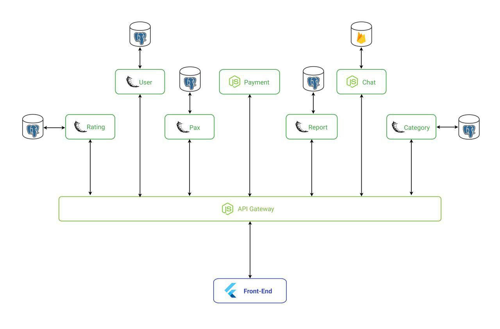

# Arquitetura V 0.0.0

Este documento visa especificar de forma básica alguns tópicos referentes ao Documento de Arquitetura que será desenvolvido no decorrer da disciplina.

## Histórico de Revisões

|    Data    | Versão |             Descrição              |   Autor(es)   |
| :--------: | :----: | :--------------------------------: | :-----------: |
| 08/09/2019 |  0.1   |        Criação do documento        | Felipe Campos |
| 15/09/2019 |  0.3   | Atualizando estrutura do documento | Felipe Campos |

## 1. Introdução

### 1.1. Finalidade

Este documento de arquitetura tem a função de especificar e documentar decisões arquiteturais relevantes na produção e implementação do projeto Pax descrevendo os aspéctos do sistema de forma clara, estruturada e objetiva.

### 1.2 Escopo

Este documento se aplica ao processo de desenvolvimento do Pax App, aplicação desenvolvida na disciplina Arquitetura e Desenho de Software, na Universidade de Brasília.

## 2. Representação Arquitetural

Modelo de representação dos serviços implementados e as interações estabelecidas entre esses serviços, bem como a natureza dessas interações.

### 2.1 Tecnologias 

### 2.1.1 Front End

* **Flutter**      

&emsp;&emsp;Flutter é um SDK de código aberto criado pelo Google para o desenvolvimento de aplicativos para Android, iOS, Desktop ou Web.
 

### 2.1.2 Back End

* **Flask**     

&emsp;&emsp;<i>Flask</i> é um micro-<i>framework</i> de <i>python</i>, possui toda a flexibilidade da linguagem <i>python</i> e provê um modelo simples para desenvolvimento <i>web</i>. É baseado em 3 pilares: <i>Werkzeug</i>, uma biblioteca para desenvolvimento de <i>apps</i> WSGI, Jinja2, um <i>template engine</i> escrito em <i>Python</i> e <i>good intentions</i>, que são alta qualidade na legibilidade, liberdade de estruturar o <i>app</i> na maneira que desejar, entre outros aspectos.

* **Express**        

&emsp;&emsp;O Express é um framework para aplicações web em Node.js. Pequeno e flexível, fornecendo um conjunto robusto de recursos para aplicativos web e mobile.

### 2.1.2 Banco de dados

* **PostgreSQL** 

&emsp;&emsp;PostgreSQL é um sistema gerenciador de banco de dados objeto relacional, desenvolvido como projeto de código aberto.

* **Firebase** 

&emsp;&emsp;O Realtime Database do Firebase é um banco de dados não relacional (NoSQL) que permite a distribuição de conteúdos cross-platform.

### 2.2 Motivação Arquitetural

&emsp;&emsp;A motivação para a escolha de cada tecnologia empregada no desenvolvimento desta aplicação pode ser consultada em maiores detalhes em nosso estudo sobre tecnologias.

[Estudo sobre Tecnologias](https://pax-app.github.io/Wiki/#/docs/DS/dinamica-e-seminario-2/Tecnologias)
### 2.3 Abordagem Arquitetural

* **Microsserviços**   

&emsp;&emsp;A arquitetura de microsserviços é uma abordagem que desmembra uma aplicação única em blocos de pequenos serviços independentes. Esses serviços executam o seu próprio processo e se comunicam, muitas vezes, por meio de métodos HTTP.

&emsp;&emsp;No <i>software</i> descrito neste documento os módulos serão:
<ul>
  <li><b>User</b>, bloco responsável por toda interação do usuário, como login, registro;
  <li><b>Rating</b>, bloco responsável pelo sistema de avaliação; </li>
  <li><b>Pax</b>, bloco responsável pelos contratos cliente-prestador;</li>
  <li><b>Payment</b>, bloco responsável por gerenciar as necessidades de pagamento; </li>
  <li><b>Report</b>, bloco responsável por gerenciar o sistema de reportes dos usuários; </li>
  <li><b>Chat</b>, bloco responsável pelo chat entre cliente-prestador.</li>
  <li><b>Category</b>, bloco reponsável pela categorização de prestadores.</li>
  <li><b>Gateway</b>, serviço responsável por intermediar a comunicação entre o Back-end e o Front-end.</li>
</ul>

* **Comunicação entre os serviços**        

&emsp;&emsp;Comunicação entre os serviços será feita por meio de uma <i>API Gateway</i>, a qual será responsável por fazer o intermédio entre os microsserviços por meio de métodos do protocolo HTTP. 

### 2.4 Diagrama de Arquitetura

#### Diagrama de Arquitetura v1.0

## 3. Restrições e Metas Arquiteturais

### Metas

|     Metas      |                                                                            |
| :------------: | :------------------------------------------------------------------------: |
| Escalabilidade |                       A aplicação deve ser escalável                       |
|   Segurança    | A aplicação deve tratar de forma de segura os dados sensíveis dos usuários |
|     Deploy     |                A aplicação deve possuir deploy automatizado                |

### Restrições

|  Restrições   |                                                                |
| :-----------: | :------------------------------------------------------------: |
| Conectividade |   É necessária a conexão com internet para utilização do App   |
|  Plataforma   |         A aplicação terá suporte somente para Android          |
|    Público    |  A aplicação será desenvolvida voltada ao público brasileiro   |
|   Linguagem   |      A aplicação será desenvolvida em português do Brasil      |
|    Equipe     |             A equipe possui apenas 10 integrantes              |
|     Prazo     | O escopo proposto deve ser terminado até o final da disciplina |

## Referências 

