# Protótipo de Alta Fidelidade

Um protótipo de alta fidelidade deve se aproximar ao máximo dos aspectos visuais e funcionais do produto final, incluindo o conteúdo, fluxo de navegação e interações. São muito utilizados para testes e validação com usuários, ou para vender uma ideia.

## Histórico de Revisões

|    Data    | Versão |                            Descrição                            |    Autor(es)    |
| :--------: | :----: | :-------------------------------------------------------------: | :-------------: |
| 19/09/2019 |  0.0   |   Adição do documento inicial com a referência da introdução       | Youssef Muhamad |
| 20/09/2019 |  0.1   |    Adição do fluxo de login, cadastro e recuperação de senha       | Youssef Muhamad |
| 20/09/2019 |  0.2   |        Código para botão principal e do input com borda            | Youssef Muhamad |
| 21/09/2019 |  0.3   |          Home e Adição de endereço na mesma com fluxo              | Youssef Muhamad |
| 21/09/2019 |  0.4   |               Código para o Card e o Modal Sheet                   | Youssef Muhamad |
| 22/09/2019 |  0.5   | Seleção de prestador de serviços da área de Assistência Técnica    | Youssef Muhamad |
| 22/09/2019 |  0.6   |       Seleção de prestador de serviços da área de Reforma          | Youssef Muhamad |
| 23/09/2019 |  0.7   |                      Meus Chats com Fluxo                          | Youssef Muhamad |
| 23/09/2019 |  0.8   |                   Reportar Serviço com Fluxo v1                    | Gabriel Albino  |
| 23/09/2019 |  0.9   |                 Histórico de serviços com Fluxo v1                 | Gabriel Albino  |
| 23/09/2019 |  1.0   |     v2 da seleção de prestador de serviço em geral                 | Youssef Muhamad  |
| 23/09/2019 |  1.1   |     v2 do 'Meus Chats'                                             | Youssef Muhamad  |
| 23/09/2019 |  1.2   |     v2 do Histórico de Contratações                                | Youssef Muhamad  |
| 23/09/2019 |  1.3   |     Telas de 'Meus Cartões' com fluxo                              | Youssef Muhamad  |
| 23/09/2019 |  1.4   |     Perfil do usuário e configurações                              | Youssef Muhamad  |
| 23/09/2019 |  1.5   |     Fluxo do usuário se tornando um prestador de serviços          | Youssef Muhamad  |
| 24/09/2019 |  1.6   |     v2 da Home do Consumidor e Adição de Endereço                  | Youssef Muhamad e Kaique Borges  |
| 24/09/2019 |  1.7   |     Categorias/Formação de Prestadores de Serviços          | Youssef Muhamad  |
| 25/09/2019 |  1.8   |     v3 do histórico de contratações          | Youssef Muhamad  |
| 27/09/2019 |  1.9   |    Home do Prestador de Serviço e seu Perfil         | Youssef Muhamad  |
| 27/09/2019 |  2.0   |    v2 das telas de Reportar um Serviço         | Youssef Muhamad  |
| 27/09/2019 |  2.1   |    Chat com envio de fotos         | Youssef Muhamad  |
| 27/09/2019 |  2.2   |    Chat com envio do endereço         | Youssef Muhamad  |
| 28/09/2019 |  2.3   |    Chat com envio do Pax         | Youssef Muhamad  |
| 29/09/2019 |  2.4   |    v4 do histórico de serviços devido a mudanças no card         | Youssef Muhamad  |
| 29/09/2019 |  2.5   |    Telas com os status dos serviços que o prestador de serviços está relacionado         | Youssef Muhamad  |

!> O presente protótipo pode ser acessado [neste Figma](https://www.figma.com/file/lSRDfsDUZeiL3YiUGhEV6k/pax-prot%C3%B3tipo-alta-fidelidade?node-id=0%3A1)

### Login v1


### Login com Fluxo v1


#### Código para o botão principal

<!-- o JS é só pra deixar colorido -->

```js
RaisedButton(
  child: Text("Entrar"),
  onPressed: () {},
  shape: RoundedRectangleBorder(
      borderRadius: new BorderRadius.circular(30.0),
  ),
)
```

#### Código para o input com borda

```js
TextField(
  decoration: new InputDecoration(
    labelText: 'Email',
    border: const OutlineInputBorder(),
  ),
),
```
**Autor:** [Youssef Muhamad](https://github.com/youssef-md)


### Perfil do Usuário e Configurações v1


### Perfil do Usuário e Configurações v1 com Fluxo


**Autor:** [Youssef Muhamad](https://github.com/youssef-md)


### Home do Consumidor de Serviços e Adição de Endereço v2

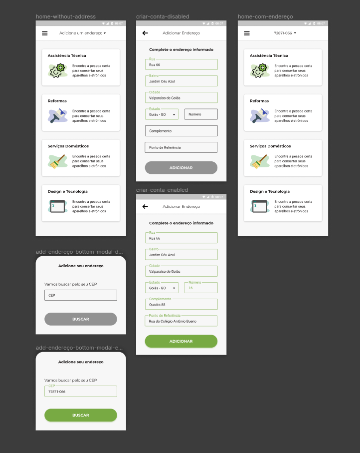

### Home do Consumidor de Serviços e Adição de Endereço com Fluxo v2

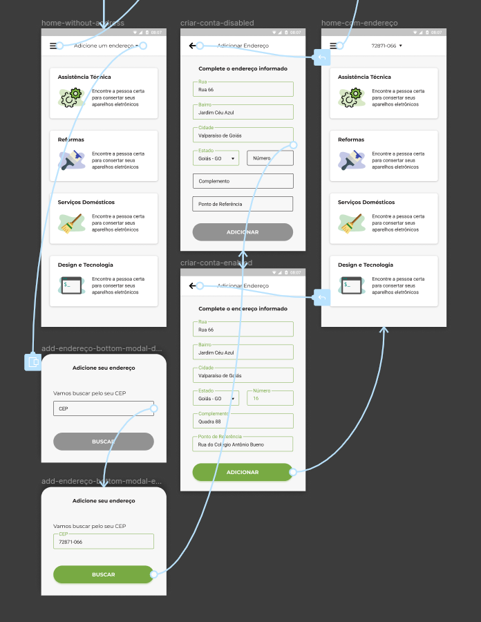

!> Nova home do consumidor de serviços com o título dentro dos respectivos cards

**Autor:** [Youssef Muhamad](https://github.com/youssef-md)


### Home do Consumidor de Serviços e Adição de Endereço v1

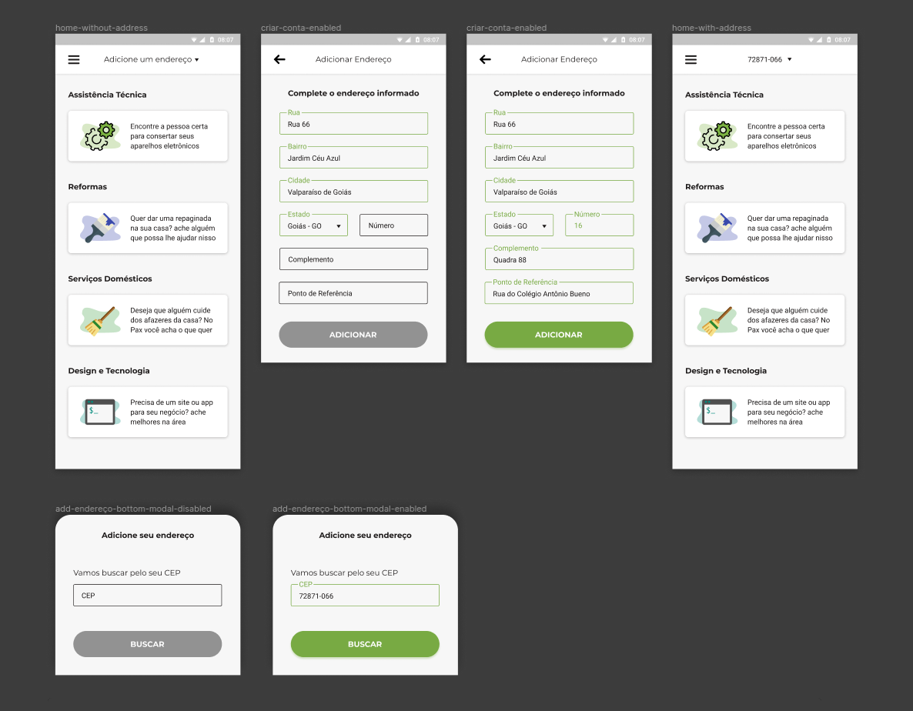

### Home do Consumidor de Serviços e Adição de Endereço com Fluxo v1


#### Código para um Card

```js
Card(
  elevation: 5,
  shape: RoundedRectangleBorder(
    borderRadius: BorderRadius.circular(15.0),
  ),
  child: Text('Sou um Card'),
),
```

#### Função para o Bottom Sheet Modal

```js
showModalBottomSheet(
  context: context,
  builder: (_) => SeuWidgetAqui()
);
```
**Autor:** [Youssef Muhamad](https://github.com/youssef-md)

### Categorias/Formação dos Prestadores de Serviços v1

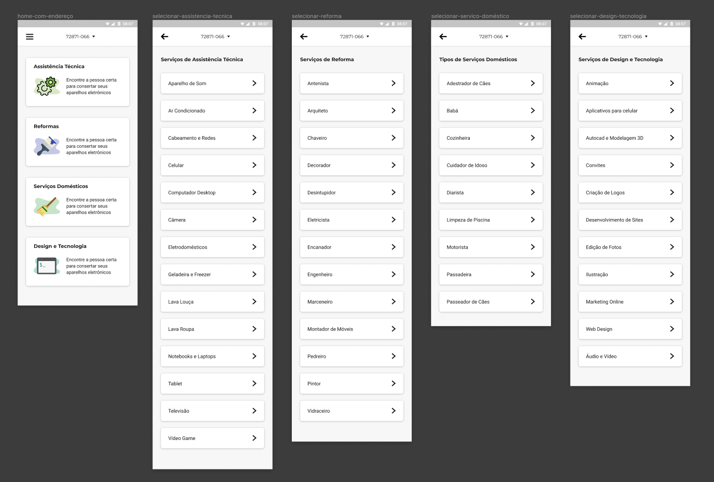

**Autor:** [Youssef Muhamad](https://github.com/youssef-md)


### Escolher Prestador de Serviços v2


!> Remoção da palavra 'Preço' antecedendo o valor nos cards dos prestadores

!> Adição do Preço no perfil do prestador

!> Remoção da text area de Bio e justificando o texto

**Autor:** [Youssef Muhamad](https://github.com/youssef-md)


### Escolher Prestador de Serviços v1


### Escolher Prestador de Serviços com Fluxo v1


#### Código para o Dialog

```js
RaisedButton(
  child: Text('Dialog'),
  onPressed: () {
    showDialog(
      context: context,
      builder: (context) => AlertDialog(
        shape: RoundedRectangleBorder(
          borderRadius: BorderRadius.circular(15),
        ),
        title: Text('Apagar Chat', textAlign: TextAlign.center),
        content: Text('O resto vai aqui...'),
      ),
    );
  },
),
```
**Autor:** [Youssef Muhamad](https://github.com/youssef-md)


### Meus Chats v2


!> Melhorando a previsibilidade do sistema, alertando o usuário da ação

**Autor:** [Youssef Muhamad](https://github.com/youssef-md)

### Meus Chats v1


### Meus Chats com Fluxo v1


#### Código para o Toast

```js
Builder(
  builder: (context) => RaisedButton(
    child: Text('TOAST'),
    onPressed: () {
      Scaffold.of(context).showSnackBar(SnackBar(
        content: const Text('Sou um Toast'),
        action: SnackBarAction(
          label: 'DESFAZER',
          textColor: Colors.green,
          onPressed: () {},
        ),
      ));
    },
  ),
)
```
**Autor:** [Youssef Muhamad](https://github.com/youssef-md)


### Chat com Envio de Foto 

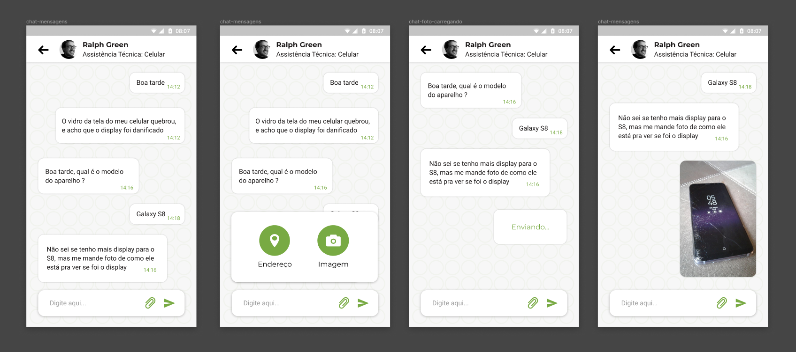

### Chat com Envio de Foto com Fluxo

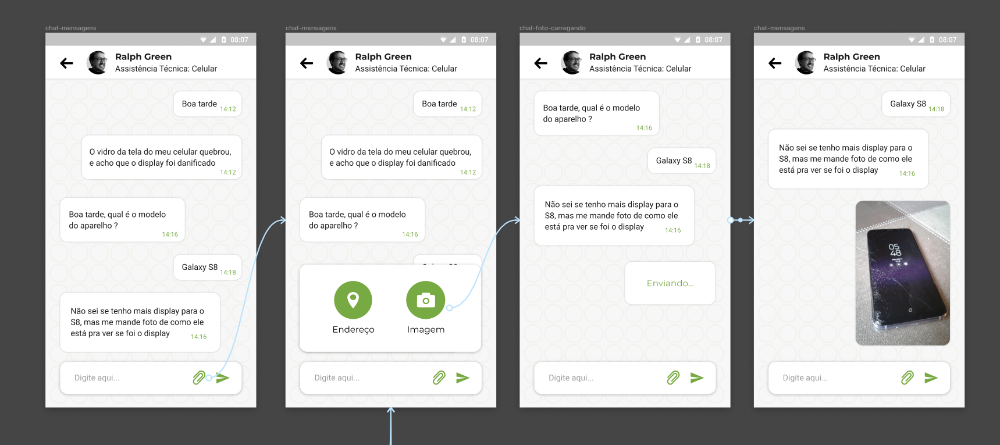

**Autor:** [Youssef Muhamad](https://github.com/youssef-md)


### Chat com Envio de Endereço 

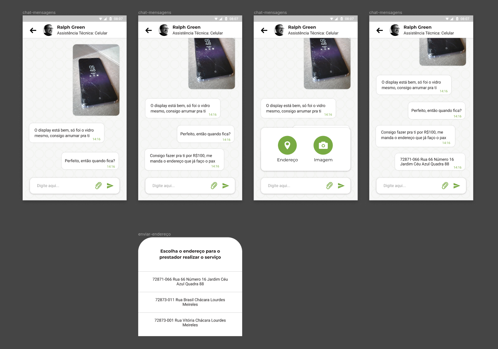

### Chat com Envio de Endereço com Fluxo

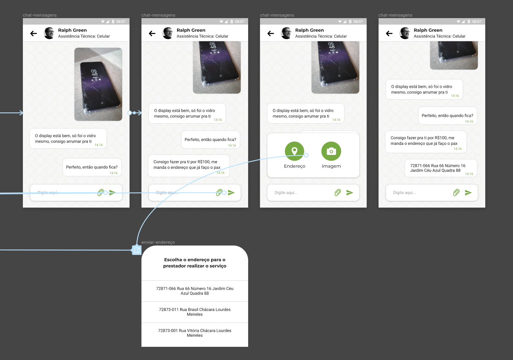

**Autor:** [Youssef Muhamad](https://github.com/youssef-md)


### Chat com Envio do Pax

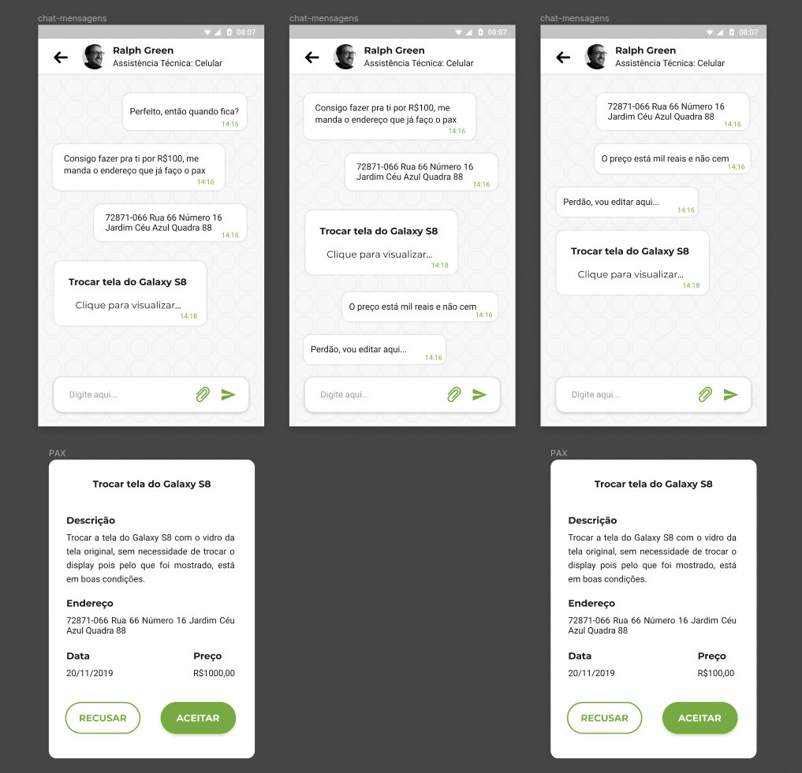

### Chat com Envio do Pax com Fluxo

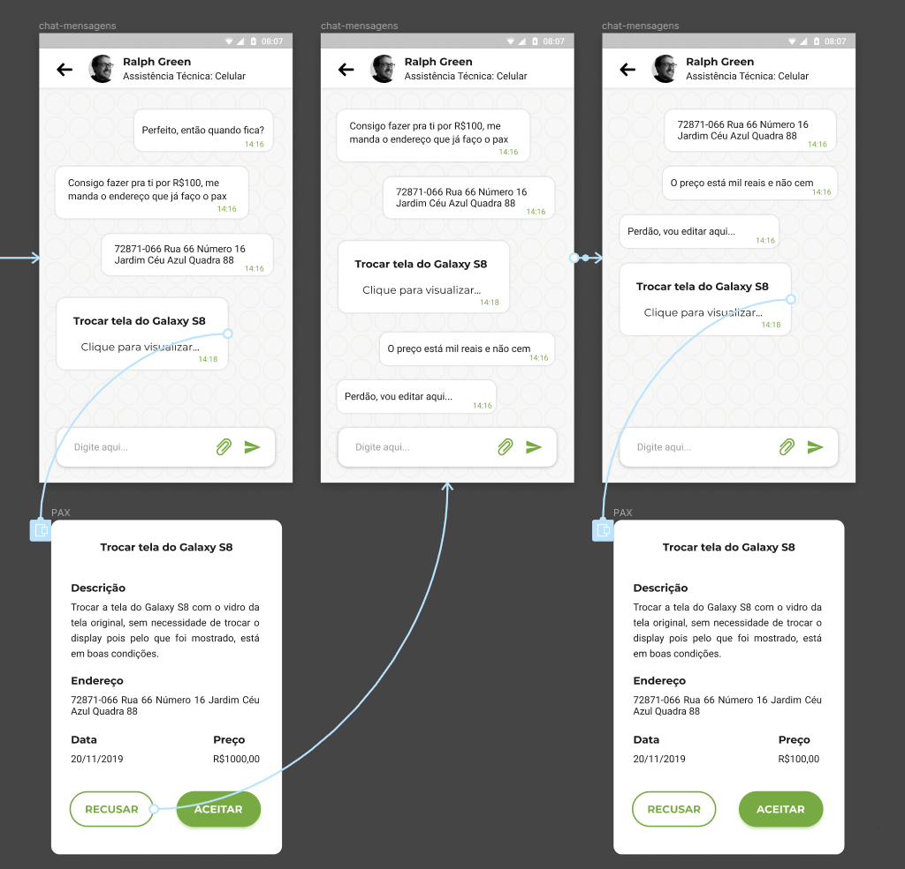

**Autor:** [Youssef Muhamad](https://github.com/youssef-md)


### Histórico de Serviços v4

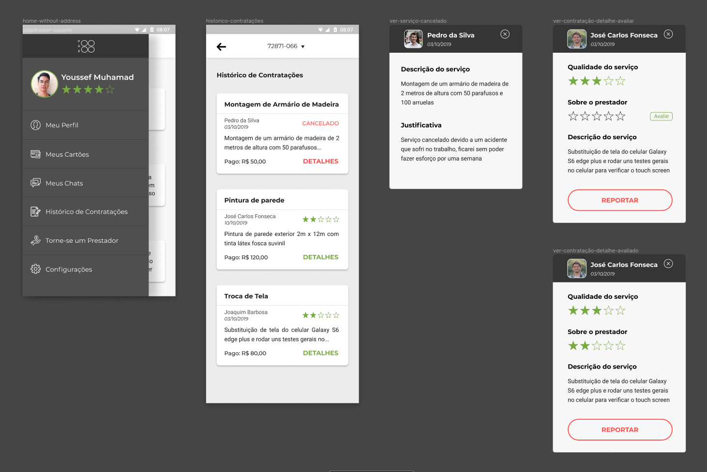

!> Melhoria no layout dos cards para ter mais espaço no título do serviço

### Histórico de Serviços v3

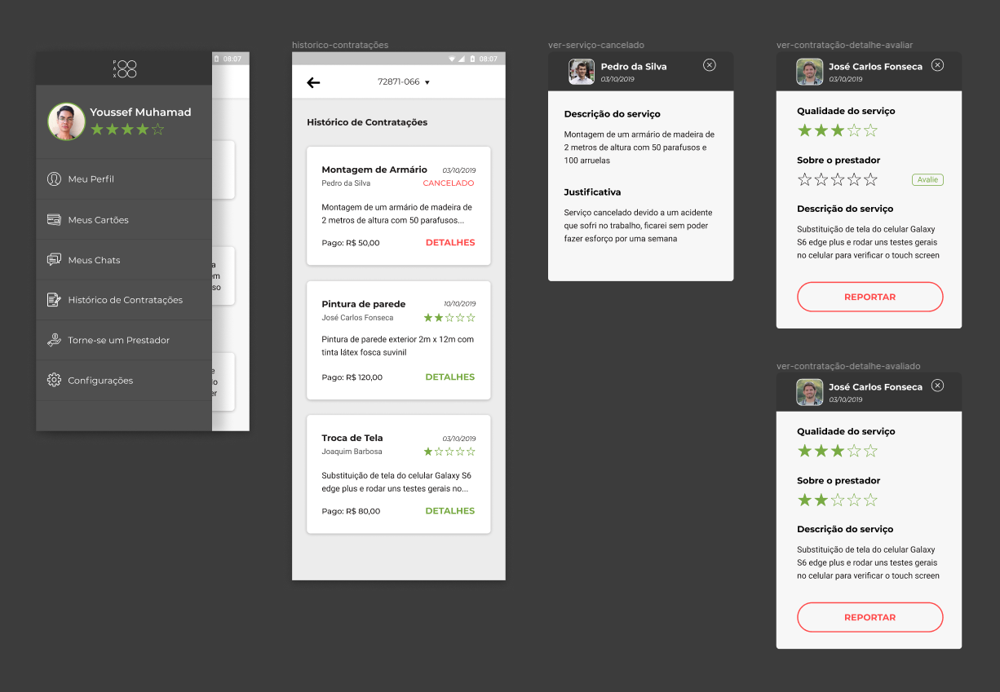


### Histórico de Serviços com Fluxo v3

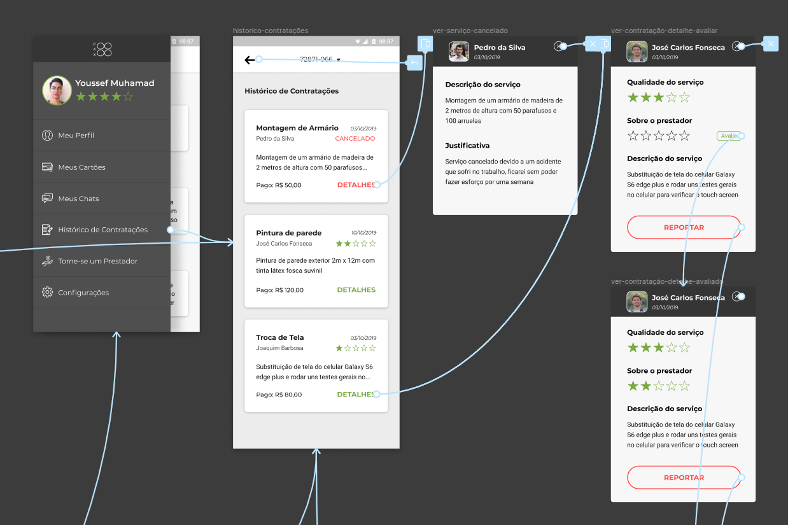

!> Adição de serviços cancelados e sua visualização detalhada

### Histórico de Serviços v2


### Histórico de Serviços com Fluxo v2


!> Padronização do sistema com Chat v2, alertando usuário para agir com cautela

!> Melhoria do espaço negativo do card de contratações

!> Melhorando o botão de 'DETALHES' para não prender a visão do usuário

**Autor:** [Youssef Muhamad](https://github.com/youssef-md)


### Histórico de Serviços v1


### Histórico de Serviços com Fluxo v1


**Autor:** [Gabriel Albino](https://github.com/gabrielalbino)


### Reportar Serviço v2

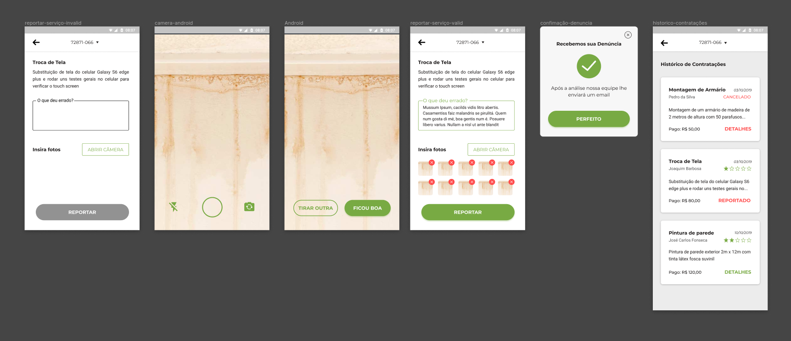

### Reportar Serviço com Fluxo v2

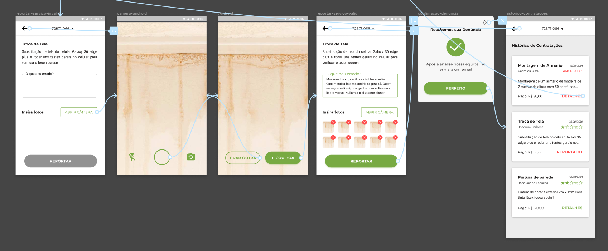

**Autor:** [Youssef Muhamad](https://github.com/youssef-md)


### Reportar Serviço v1

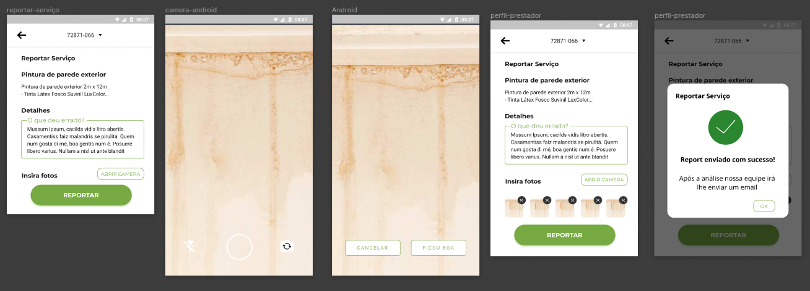

### Reportar Serviço com Fluxo v1


**Autor:** [Gabriel Albino](https://github.com/gabrielalbino)


### Meus Cartões v1


### Meus Cartões com Fluxo v1


**Autor:** [Youssef Muhamad](https://github.com/youssef-md)


### Tornar-se um Prestador de Serviço v1

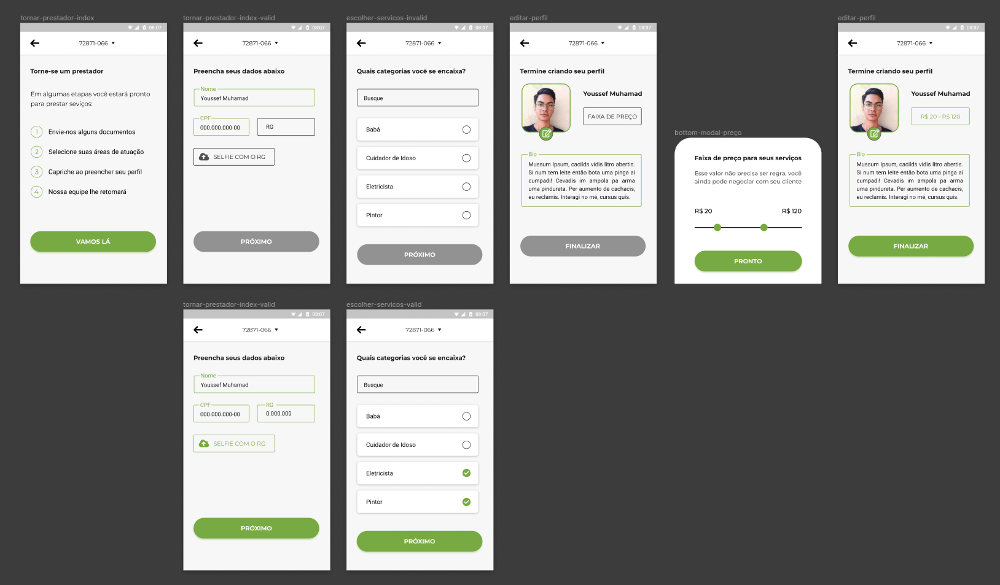

### Tornar-se um Prestador de Serviço com Fluxo v1

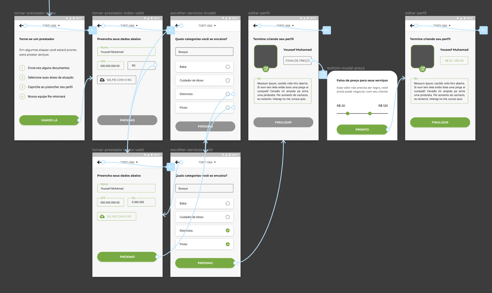

**Autor:** [Youssef Muhamad](https://github.com/youssef-md)


### Home do Prestador de Serviço e seu Perfil

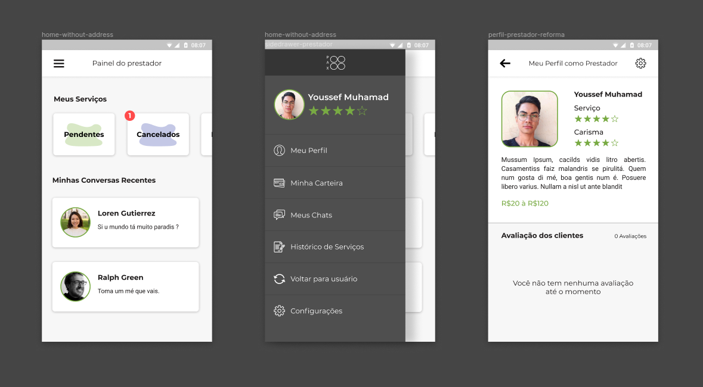

### Home do Prestador de Serviço e seu Perfil com Fluxo

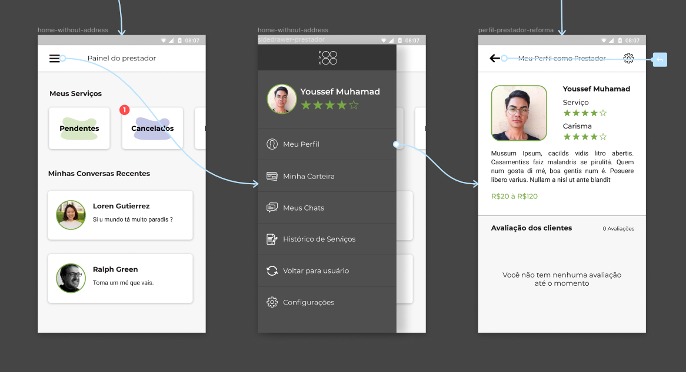

**Autor:** [Youssef Muhamad](https://github.com/youssef-md)


### Telas dos Status dos Serviços do Prestador

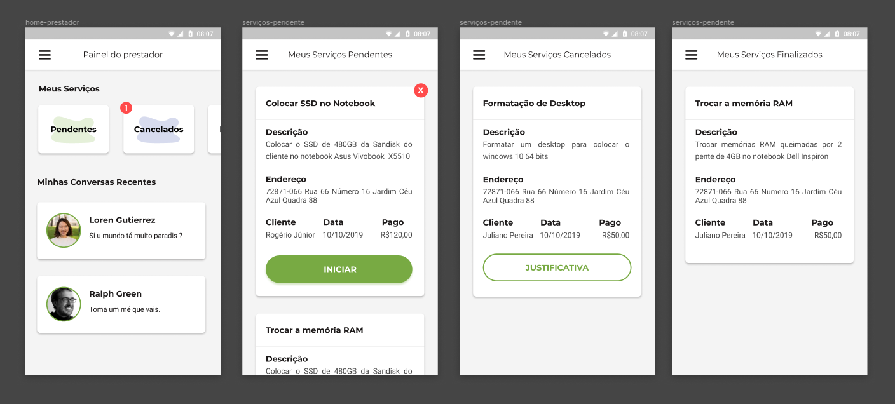

**Autor:** [Youssef Muhamad](https://github.com/youssef-md)

### Telas dos Status dos Serviços do Prestador com Fluxo


**Autor:** [Youssef Muhamad](https://github.com/youssef-md)


## Referências

- NIELSEN, Jakob. **10 Usability Heuristics for User Interface Design**. 24 abr. 1994. Disponível em: https://www.nngroup.com/articles/ten-usability-heuristics/. Acesso em: 1 set. 2019.

- **Baixa, média ou alta fidelidade? Conheça as diferenças entre os tipos de protótipos**. Acessado dia 19/09/2019** em: <https://dextra.com.br/pt/baixa-media-ou-alta-fidelidade-conheca-as-diferencas-entre-os-tipos-de-prototipos/>
