# Protótipo de Alta Fidelidade

Um protótipo de alta fidelidade deve se aproximar ao máximo dos aspectos visuais e funcionais do produto final, incluindo o conteúdo, fluxo de navegação e interações. São muito utilizados para testes e validação com usuários, ou para vender uma ideia.

## Histórico de Revisões

|    Data    | Versão |                            Descrição                            |    Autor(es)    |
| :--------: | :----: | :-------------------------------------------------------------: | :-------------: |
| 19/09/2019 |  0.0   |   Adição do documento inicial com a referência da introdução       | Youssef Muhamad |
| 20/09/2019 |  0.1   |    Adição do fluxo de login, cadastro e recuperação de senha       | Youssef Muhamad |
| 20/09/2019 |  0.2   |        Código para botão principal e do input com borda            | Youssef Muhamad |
| 21/09/2019 |  0.3   |          Home e Adição de endereço na mesma com fluxo              | Youssef Muhamad |
| 21/09/2019 |  0.4   |               Código para o Card e o Modal Sheet                   | Youssef Muhamad |
| 22/09/2019 |  0.5   | Seleção de prestador de serviços da área de Assistência Técnica    | Youssef Muhamad |
| 22/09/2019 |  0.6   |       Seleção de prestador de serviços da área de Reforma          | Youssef Muhamad |
| 23/09/2019 |  0.7   |                      Meus Chats com Fluxo                          | Youssef Muhamad |
| 23/09/2019 |  0.8   |                   Reportar Serviço com Fluxo v1                    | Gabriel Albino  |
| 23/09/2019 |  0.9   |                 Histórico de serviços com Fluxo v1                 | Gabriel Albino  |
| 23/09/2019 |  1.0   |     v2 da seleção de prestador de serviço em geral                 | Youssef Muhamad  |
| 23/09/2019 |  1.1   |     v2 do 'Meus Chats'                                             | Youssef Muhamad  |
| 23/09/2019 |  1.2   |     v2 do Histórico de Contratações                                | Youssef Muhamad  |
| 23/09/2019 |  1.3   |     Telas de 'Meus Cartões' com fluxo                                | Youssef Muhamad  |
| 23/09/2019 |  1.4   |     Perfil do usuário e configurações                                | Youssef Muhamad  |

!> O presente protótipo pode ser acessado [neste Figma](https://www.figma.com/file/lSRDfsDUZeiL3YiUGhEV6k/pax-prot%C3%B3tipo-alta-fidelidade?node-id=0%3A1)

### Login v1


### Login com Fluxo v1


#### Código para o botão principal

<!-- o JS é só pra deixar colorido -->

```js
RaisedButton(
  child: Text("Entrar"),
  onPressed: () {},
  shape: RoundedRectangleBorder(
      borderRadius: new BorderRadius.circular(30.0),
  ),
)
```

#### Código para o input com borda

```js
TextField(
  decoration: new InputDecoration(
    labelText: 'Email',
    border: const OutlineInputBorder(),
  ),
),
```
**Autor:** [Youssef Muhamad](https://github.com/youssef-md)


### Perfil do Usuário e Configurações v1

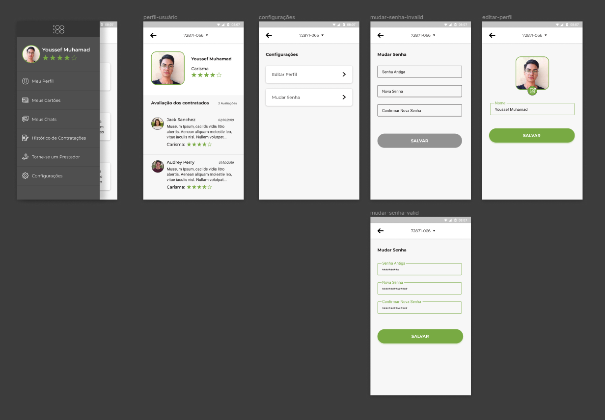

### Perfil do Usuário e Configurações v1 com Fluxo

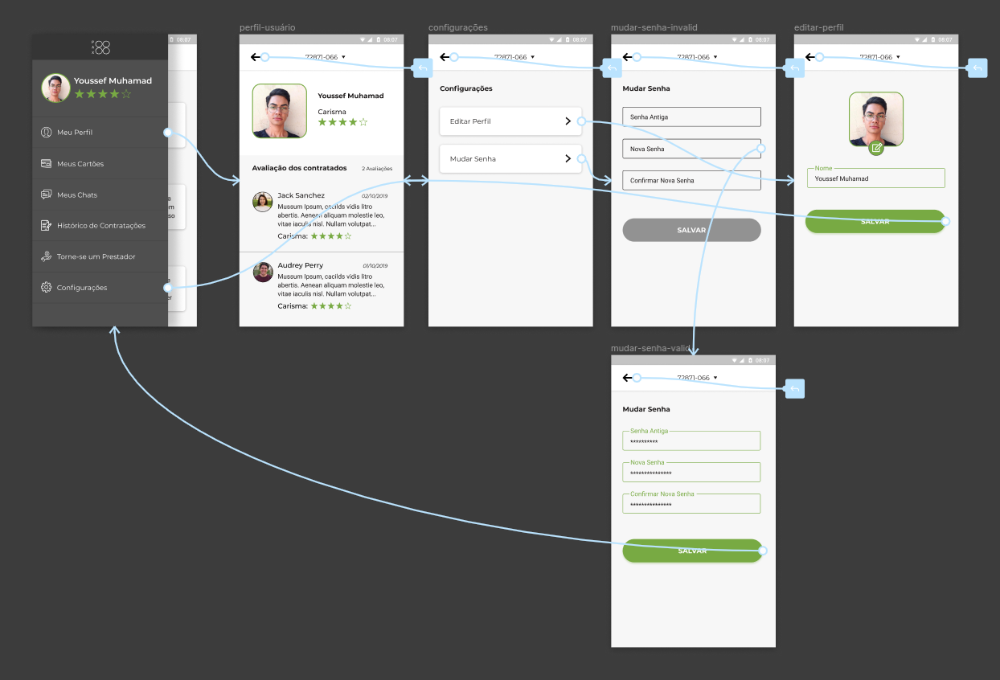

**Autor:** [Youssef Muhamad](https://github.com/youssef-md)


### Home e Adição de Endereço v1


### Home e Adição de Endereço com Fluxo v1

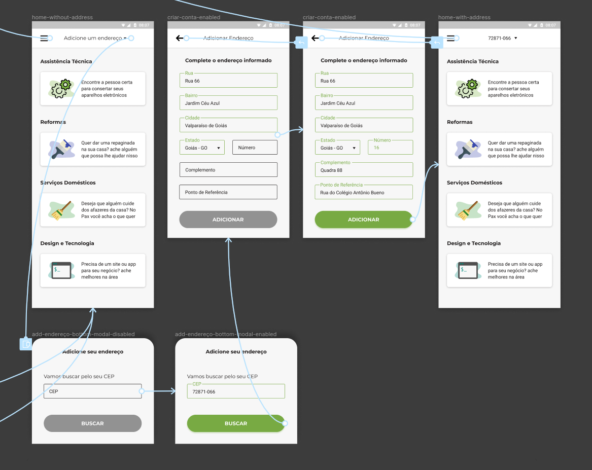

#### Código para um Card

```js
Card(
  elevation: 5,
  shape: RoundedRectangleBorder(
    borderRadius: BorderRadius.circular(15.0),
  ),
  child: Text('Sou um Card'),
),
```

#### Função para o Bottom Sheet Modal

```js
showModalBottomSheet(
  context: context,
  builder: (_) => SeuWidgetAqui()
);
```
**Autor:** [Youssef Muhamad](https://github.com/youssef-md)


### Escolher Prestador de Serviços v2

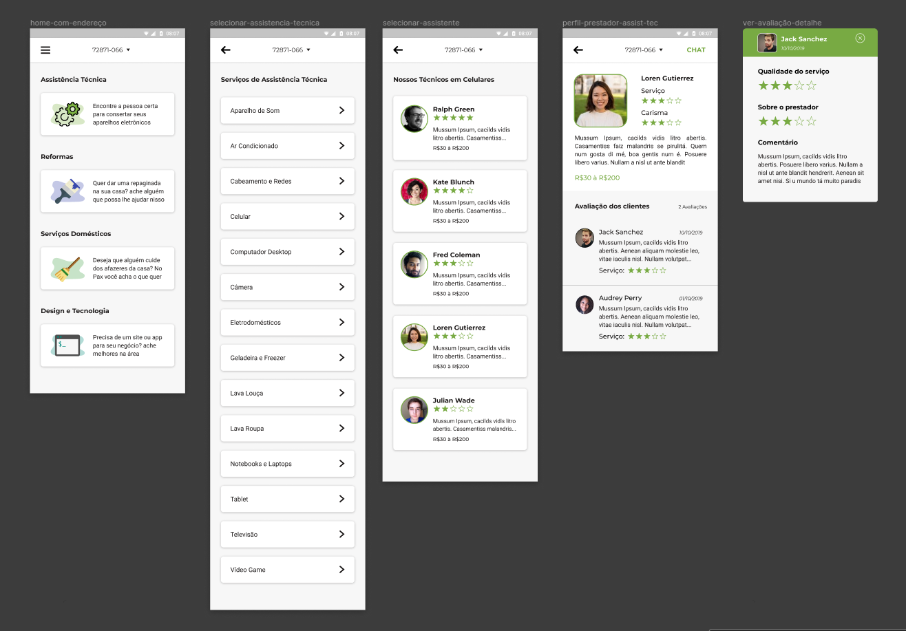

!> Remoção da palavra 'Preço' antecedendo o valor nos cards dos prestadores

!> Adição do Preço no perfil do prestador

!> Remoção da text area de Bio e justificando o texto

**Autor:** [Youssef Muhamad](https://github.com/youssef-md)


### Escolher Prestador de Serviços v1

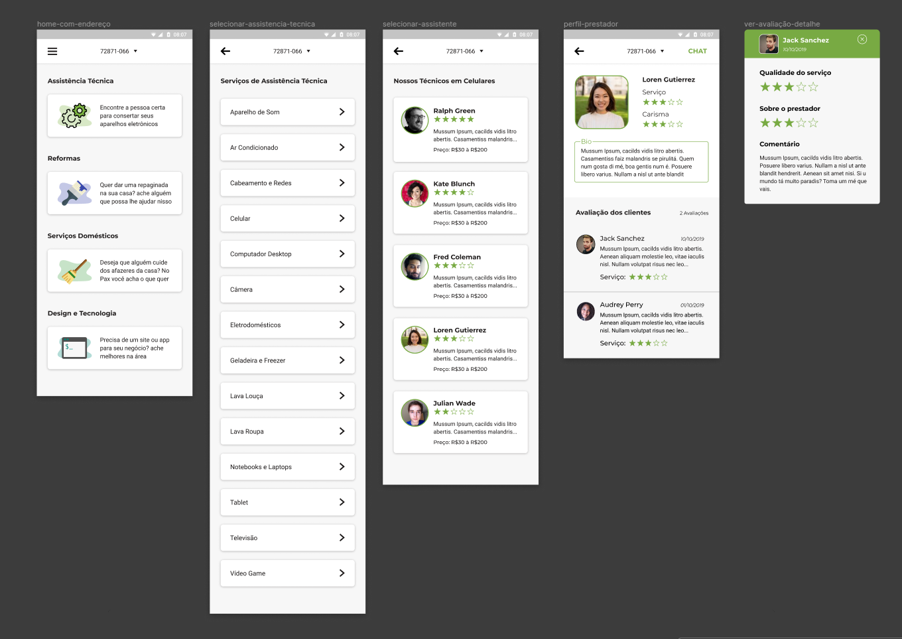

### Escolher Prestador de Serviços com Fluxo v1


#### Código para o Dialog

```js
RaisedButton(
  child: Text('Dialog'),
  onPressed: () {
    showDialog(
      context: context,
      builder: (context) => AlertDialog(
        shape: RoundedRectangleBorder(
          borderRadius: BorderRadius.circular(15),
        ),
        title: Text('Apagar Chat', textAlign: TextAlign.center),
        content: Text('O resto vai aqui...'),
      ),
    );
  },
),
```
**Autor:** [Youssef Muhamad](https://github.com/youssef-md)

### Meus Chats v2

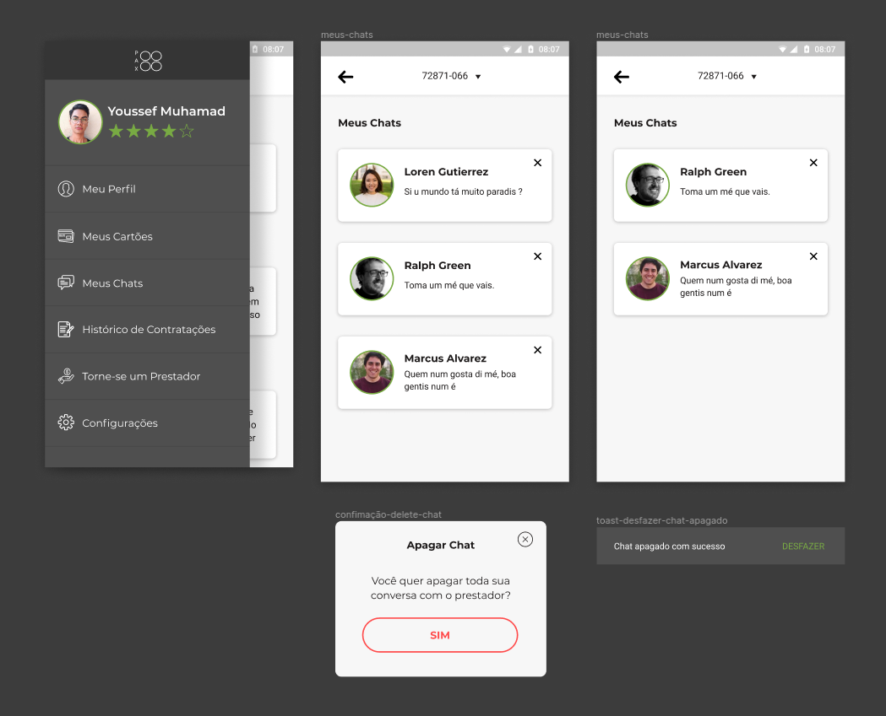

!> Melhorando a previsibilidade do sistema, alertando o usuário da ação

**Autor:** [Youssef Muhamad](https://github.com/youssef-md)

### Meus Chats v1


### Meus Chats com Fluxo v1

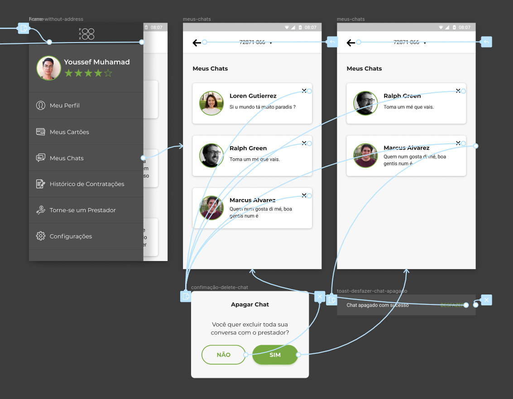

#### Código para o Toast

```js
Builder(
  builder: (context) => RaisedButton(
    child: Text('TOAST'),
    onPressed: () {
      Scaffold.of(context).showSnackBar(SnackBar(
        content: const Text('Sou um Toast'),
        action: SnackBarAction(
          label: 'DESFAZER',
          textColor: Colors.green,
          onPressed: () {},
        ),
      ));
    },
  ),
)
```
**Autor:** [Youssef Muhamad](https://github.com/youssef-md)

### Histórico de Serviços v2

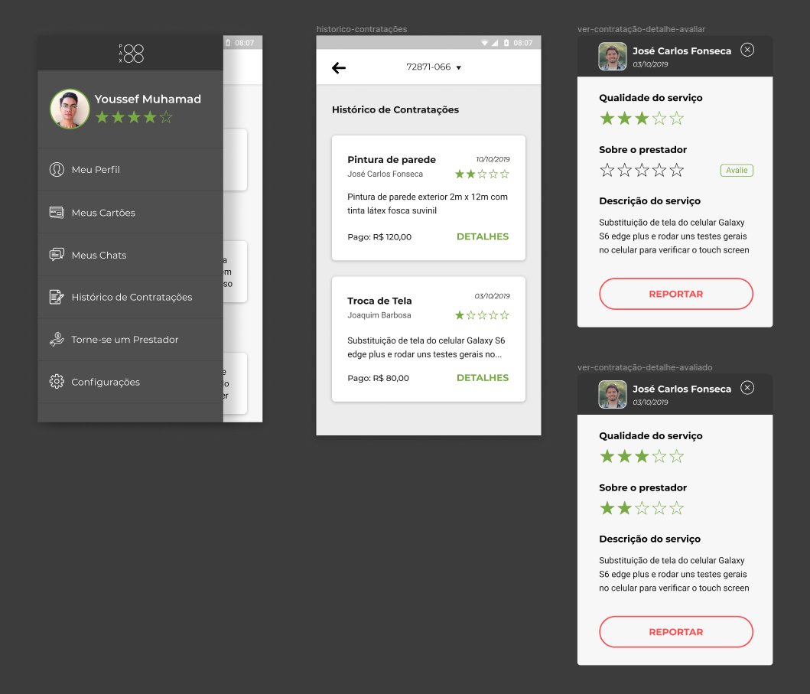

### Histórico de Serviços com Fluxo v2

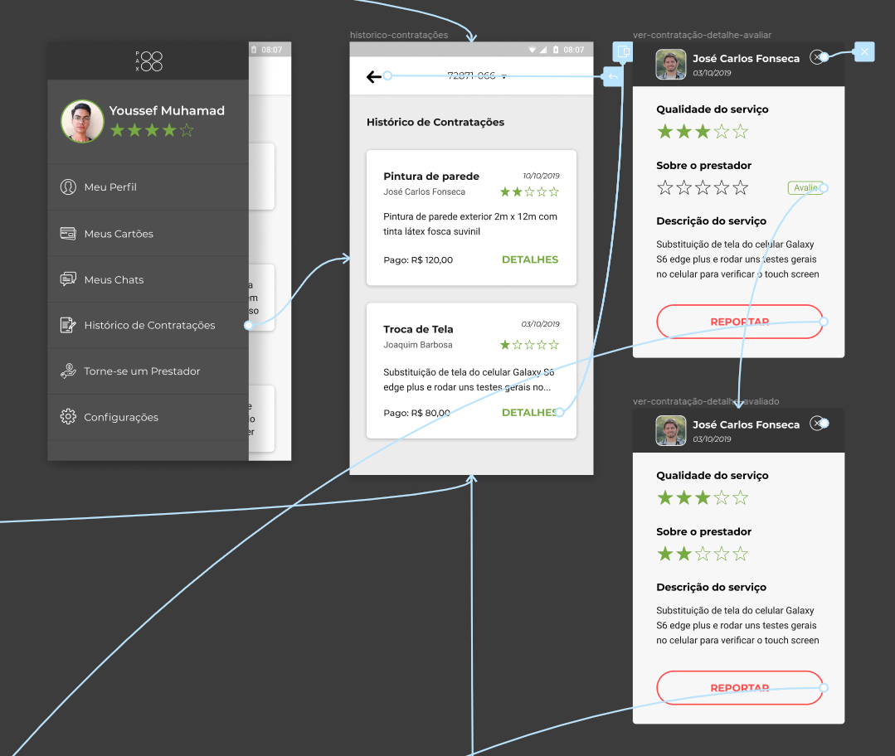

!> Padronização do sistema com Chat v2, alertando usuário para agir com cautela

!> Melhoria do espaço negativo do card de contratações

!> Melhorando o botão de 'DETALHES' para não prender a visão do usuário

**Autor:** [Youssef Muhamad](https://github.com/youssef-md)


### Histórico de Serviços v1

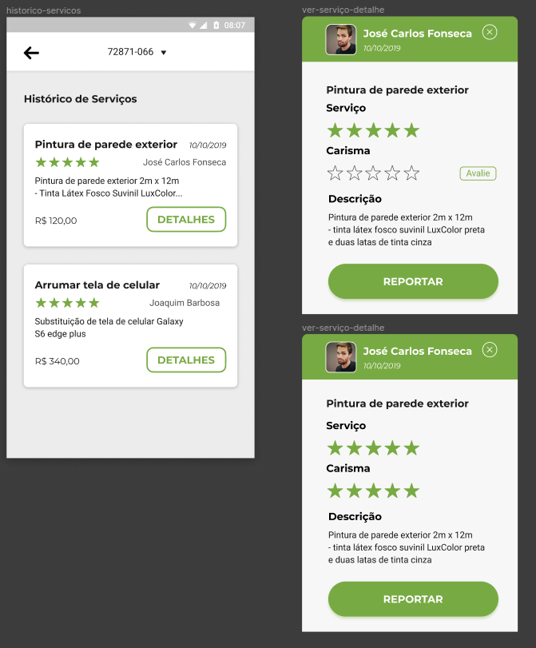

### Histórico de Serviços com Fluxo v1

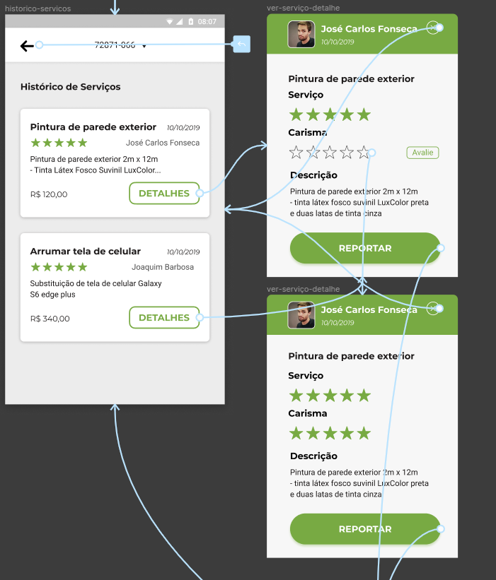

**Autor:** [Gabriel Albino](https://github.com/gabrielalbino)

### Reportar Serviço v1


### Reportar Serviço com Fluxo v1

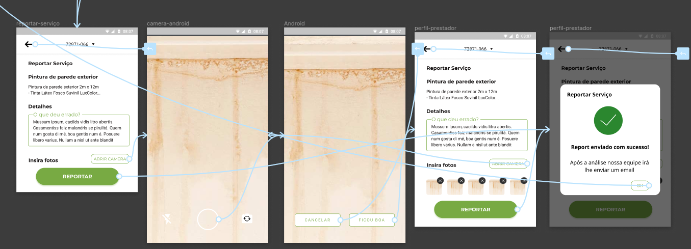

**Autor:** [Gabriel Albino](https://github.com/gabrielalbino)


### Meus Cartões v1

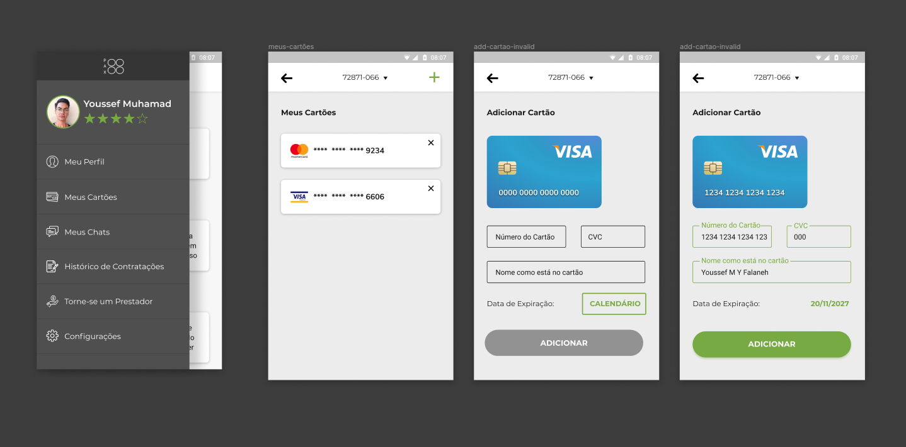

### Meus Cartões com Fluxo v1

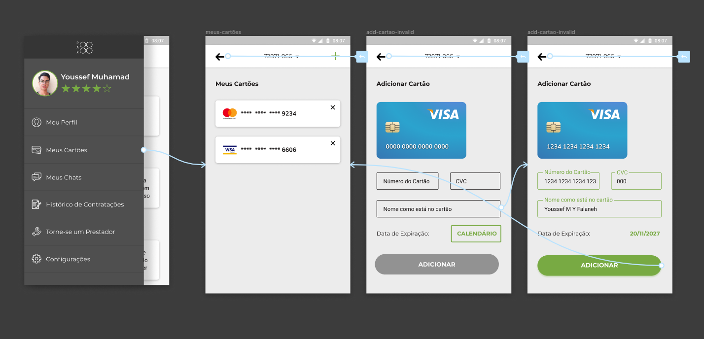

**Autor:** [Youssef Muhamad](https://github.com/youssef-md)


## Referências

- Baixa, média ou alta fidelidade? Conheça as diferenças entre os tipos de protótipos. Acessado dia **19/09/2019** em: <https://dextra.com.br/pt/baixa-media-ou-alta-fidelidade-conheca-as-diferencas-entre-os-tipos-de-prototipos/>
