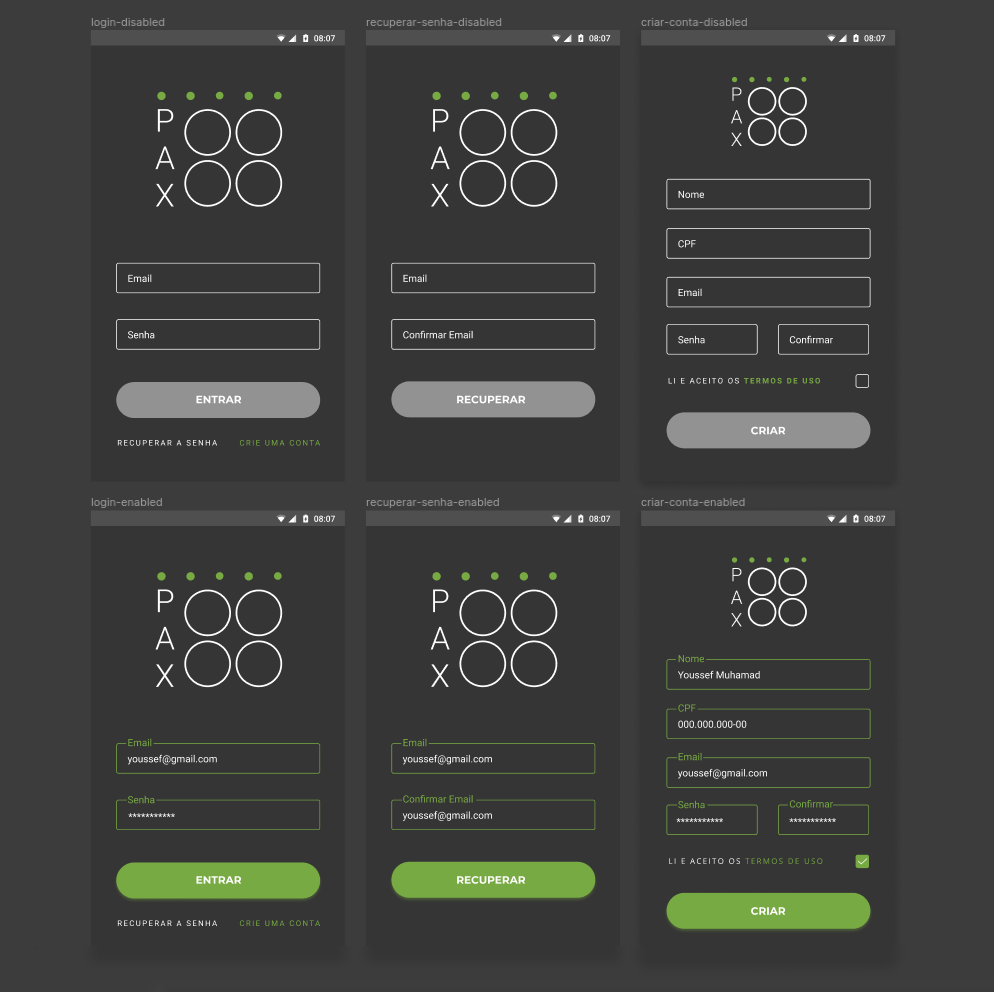
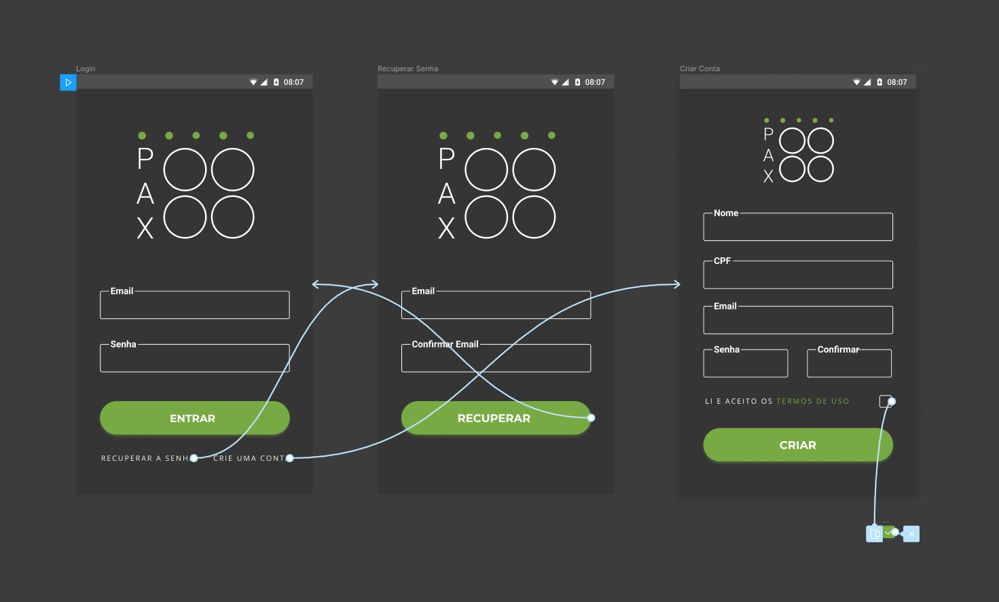

# Protótipo de Alta Fidelidade

Um protótipo de alta fidelidade deve se aproximar ao máximo dos aspectos visuais e funcionais do produto final, incluindo o conteúdo, fluxo de navegação e interações. São muito utilizados para testes e validação com usuários, ou para vender uma ideia.

## Histórico de Revisões

| Data            | Versão    |              Descrição            |    Autor(es) |
| :--: | :----: | :-------: | :-------: |
|   19/09/2019    |   0.0     |    Adição do documento inicial com a referência da introdução   |      Youssef Muhamad |
|   20/09/2019    |   0.1     |    Adição do fluxo de login, cadastro e recuperação de senha    |      Youssef Muhamad |
|   20/09/2019    |   0.2     |    Código para botão principal e do input com borda             |      Youssef Muhamad |

!> O presente protótipo pode ser acessado  [neste Figma](https://www.figma.com/file/lSRDfsDUZeiL3YiUGhEV6k/pax-prot%C3%B3tipo-alta-fidelidade?node-id=0%3A1)

### Login v1


### Login com Fluxo v1


#### Código para o botão principal
<!-- o JS é só pra deixar colorido -->
```js 
RaisedButton(
  child: Text("Entrar"),
  onPressed: () {},
  shape: RoundedRectangleBorder(
      borderRadius: new BorderRadius.circular(30.0),
  ),
)
```

#### Código para o input com borda
```js
TextField(
  decoration: new InputDecoration(
    labelText: 'Email',
    border: const OutlineInputBorder(),
  ),
),
```

**Autor:** [Youssef Muhamad](https://github.com/youssef-md)

## Referências

- Baixa, média ou alta fidelidade? Conheça as diferenças entre os tipos de protótipos. Acessado dia **19/09/2019** em: <https://dextra.com.br/pt/baixa-media-ou-alta-fidelidade-conheca-as-diferencas-entre-os-tipos-de-prototipos/>
