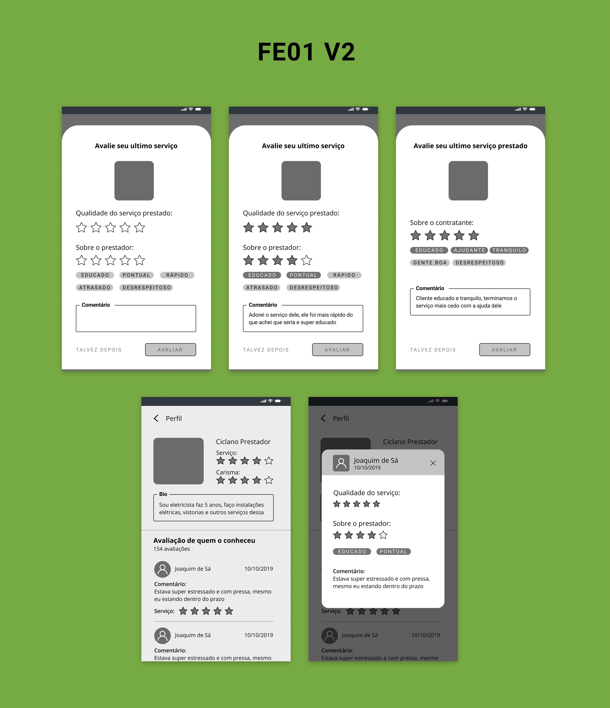

# Protótipo de Média Fidelidade

O **Protótipo de Média Fidelidade** é um pouco mais refinado que o de baixa fidelidade, mas ainda não necessita de uma preocupação estética. Também conhecido como wireframe, é utilizado quando o foco é validar a arquitetura da informação e a interatividade com os elementos da interface.

|    Data    | Versão |                      Descrição                       |    Autor(es)    |
| :--------: | :----: | :--------------------------------------------------: | :-------------: |
| 08/09/2019 |  1.0   |    Adição da Feature FE01 do protótipo com fluxos    | Gabriel Albino  |
| 08/09/2019 |  1.1   | Adição da v2 da Feature FE01 do protótipo com fluxos | Youssef Muhamad |
| 08/09/2019 |  1.2   |    Adição da Feature FE02 do protótipo com fluxos    | Gabriel Albino  |
| 08/09/2019 |  1.3   | Adição da v2 da Feature FE02 do protótipo com fluxos | Youssef Muhamad |
| 08/09/2019 |  1.4   |    Adição da Feature FE03 do protótipo com fluxos    | Youssef Muhamad |
| 08/09/2019 |  1.5   |    Adição da Feature FE04 do protótipo com fluxos    | Youssef Muhamad |
| 08/09/2019 |  1.6   |    Adição da Feature FE06 do protótipo com fluxos    | Gabriel Albino  |
| 08/09/2019 |  1.7   |    Adição da Feature FE08 do protótipo com fluxos    | Gabriel Albino  |

O Protótipo a seguir tem como finalidade condensar todos os artefatos e brainstorms que a equipe produziu. Este artefato se provou necessário já que até então tínhamos bastante dúvidas de como seria o funcionamento de uma determinada feature e se ela teria um nível de usabilidade aceitável para o usuário final. Portanto, este documento está separado nas features presentes no [backlog v2](docs/DS/dinamica-e-seminario-2/Backlog.md#versão-20) e está disponível [neste Figma](https://www.figma.com/file/cmUWUCrBPoO11hGFuuNu7z/Prot%C3%B3tipo-de-M%C3%A9dia-Fidelidade?node-id=0%3A1) para a realização de testes de usabilidade.

### Feature 01 v1

**Autor**: [Gabriel Albino](https://github.com/gabrielalbino)

### Feature 01 v2

**Autor**: [Youssef Muhamad](https://github.com/youssef-md)

### Feature 02 v1

**Autor**: [Gabriel Albino](https://github.com/gabrielalbino)

### Feature 02 v2

**Autor**: [Youssef Muhamad](https://github.com/youssef-md)

### Feature 03 v1

**Autor**: [Youssef Muhamad](https://github.com/youssef-md)

### Feature 04 v1

**Autor**: [Youssef Muhamad](https://github.com/youssef-md)

### Feature 06 + Feature 08 v1

**Autor**: [Gabriel Albino](https://github.com/gabrielalbino)

### Referências:

- [Protótipos de Baixa Fidelidade](docs/DS/dinamica-e-seminario-2/PrototipoBaixaFidelidade.md)
- Protótipos de baixa, média e alta fidelidade. Acessado dia **09/09/2019** em: <http://jeffersonalex.com.br/design/prototipos-de-baixa-media-e-alta-fidelidade/>
- Baixa, média ou alta fidelidade? Conheça as diferenças entre os tipos de protótipos. Acessado dia **09/09/2019** em: <https://dextra.com.br/pt/baixa-media-ou-alta-fidelidade-conheca-as-diferencas-entre-os-tipos-de-prototipos/>
