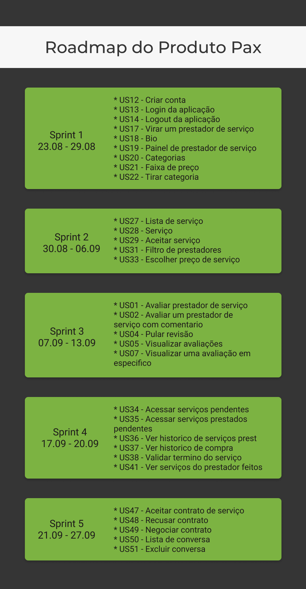

# Roadmap

O roadmap de produto é um plano que combina os objetivos do negócio, as necessidades e desejos dos clientes em relação a esse produto e as tarefas necessárias para atingir esses objetivos. O ultilizamos para ter uma ideia do andamento do projeto.

## Histórico de Revisões

| Data | Versão | Descrição | Autor(es) |
| :--: | :----: | :-------: | :-------: |
|  22/09/2019    |    1.0    |   Criação do documento        |    Ésio Freitas       |

## Roadmap do Produto V1

**Autor:** [Esio Gustavo](https://github.com/EsioFreitas)

## Referências

* ENDEAVOR BRASIL. **Roadmap**: a bússola para desenvolver seu produto ou projeto. [S. l.], 2017. Disponível em: https://endeavor.org.br/estrategia-e-gestao/roadmap/. Acesso em: 22 set. 2019.

- MATHIAS, Lucas. **8 passos para criar um roadmap de produto**. [S. l.], 2018. Disponível em: https://mindminers.com/blog/roadmap-de-produto/. Acesso em: 22 set. 2019.