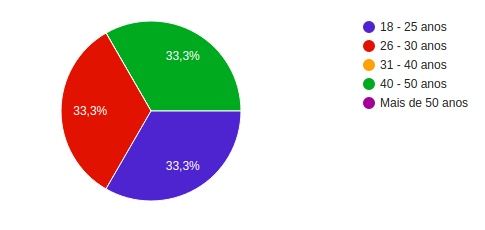
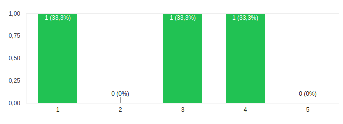

# Teste de Usabilidade no Wireframe

Teste de usabilidade é uma técnica de pesquisa utilizada para avaliar um produto ou serviço. Os testes são realizados com usuários representativos do público-alvo. Cada participante tenta realizar tarefas típicas enquanto o analista observa-o e documenta como foi a performance do participante, para que com estes dados ele consiga ter noção do que está usável ou não para o usuário final.

## Histórico de Revisões

|    Data    | Versão |               Descrição                |           Autor(es)            |
| :--------: | :----: | :------------------------------------: | :----------------------------: |
| 13/09/2019 |  0.1   | Introdução sobre testes de usabilidade |        Youssef Muhamad         |
| 13/09/2019 |  0.2   |       Adicionando as referências       | Ésio Freitas e Youssef Muhamad |
| 18/09/2019 |  1.0   |         Adicionando resultados         |          Ésio Freitas          |
| 22/09/2019 |  1.1   |         Formatando referências ABNT         |                 Rogério Júnior               |

## Tarefas a Serem Avaliadas

- Ver informações sobre a aplicação
- Facilidade de avaliação de serviço
- Facilidade de reportar um serviço
- Cadastrar um usuário
- Torná-se um prestador de serviço
- Solicitar um serviço
- Contratar um serviço

## Usuários

### Idade

### Gênero

### Uso de aplicativos que terceirizam atividades

## Cenário

Os cenários foram escritos de forma que a condução dos testes não sugerisse explicitamente como os usuários deveriam executar. Os usuários receberam uma breve explicação do que é o sistema e o que pode ser feito com ele antes dos testes. Foi solicitado aos usuários que dissessem suas ações em voz alta para que o condutor do teste pudesse saber o que eles estão pensando ao executar as tarefas.

### Preparação

- O protótipo foi aberto em topicos
- Os testes foram abertos e registrados todos online
- Os testes foram gravados para maior rastreabilidade

### Execução

Você está em semana de prova e tem tempo que não sai com seu cachorro. Mas você lembra que uma amiga te recomendou um aplicativo que você pode contratar pessoas para fazer serviços para você. Você pega o celular, baixa o aplicativo e entra nele.

1 - Agora você precisa fazer uma conta no aplicativo.

2 - Agora você precisa procurar um prestador de serviço e combinar um serviço com ele.

3 - O prestador de serviço veio em sua residencia, andou com o seu cachorro e entregou de volta para você. Como foi uma pessoa muito agradável e o serviço foi ótimo, você decide avaliá-lo.

4 - Depois de um tempo você pediu para um encanador arrumar sua pia, mas ele foi embora e ela começou a pingar. Por isso você precisa fazer um report.

5 - Querendo ganhar uma renda extra, você quer oferecer seus serviços de arrumar o guarda-roupa no aplicativo. Agora você precisa se tornar um prestador de serviço.

## Resultados

### O que deu certo

O fluxo testado foi de facil acesso para pessoas asntre 18 e 49 anos. Isso acabou facilitando o desenvolvimento da proxima etapa do protótipo (protótipo de alto nível) que será usado para desenvolvimento do produto final. Alem disso, conseguimos pegar feedback de de validação de usuário e área de prestador de serviço.  

### O que deu errado

No entanto, em primeiro momento, pessoas mais velhas, ou seja, acima de 50 anos, tiveram dificuldade com o fluxo do aplicativo. Isso se deu pela falta de uma boa elaboração de um protótipo funcional devido ao tempo curto para os testes. 

## Referências

* CAELUM. **Testes de Usabilidade.** [S. l.], 2014. Disponível em: https://www.caelum.com.br/apostila-ux-usabilidade-mobile-web/usabilidade/. Acesso em: 13 set. 2019.

- VOLPATO, Elisa. **Teste de usabilidade**: o que é e para que serve?. [S. l.], 2014. Disponível em: https://brasil.uxdesign.cc/teste-de-usabilidade-o-que-%C3%A9-e-para-que-serve-de3622e4298b. Acesso em: 13 set. 2019.