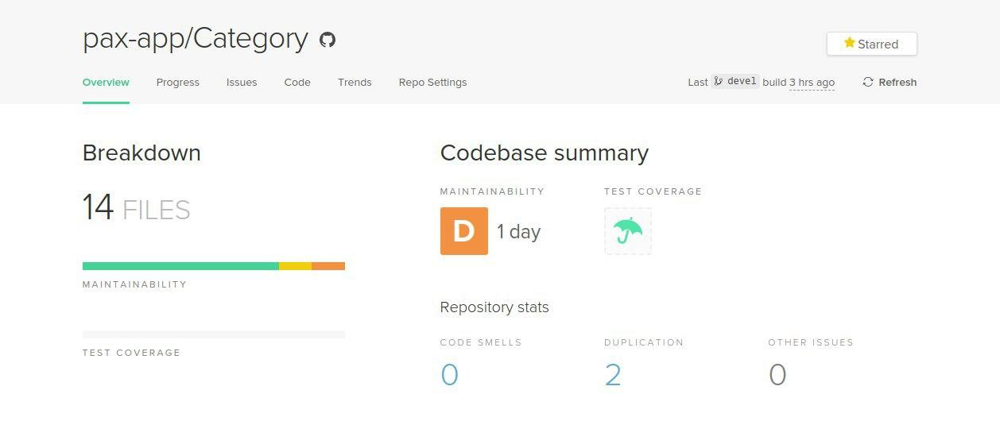

# [Category](https://github.com/pax-app/Category)

Camada da aplicação responsável pelas categorias gerais e de serviço disponíveis no sistema.

## Padrões usados:

### Strategy

O Strategy é um _Design Pattern_ comportamental que permite definir uma família de algoritmos, colocar cada um deles em uma classe separada e tornar seus objetos intercambiáveis.

É frequentemente usado em várias estruturas para fornecer aos usuários uma maneira de alterar o comportamento de uma classe sem estendê-lo.

O Strategy foi utilizado como forma de usar diferentes variações do método de retorno da API de acordo com cada tipo de categoria definida.

**Arquivo:** [models.py](https://github.com/pax-app/Category/blob/devel/project/api/models.py)

### [⬅](docs/DS/dinamica-e-seminario-4-b/comportamentais.md#strategy)

### Facade

O Facade é especialmente útil ao trabalhar com bibliotecas e APIs complexas.

Facade pode ser reconhecida em uma classe que possui uma interface simples, mas delega a maior parte do trabalho para outras classes. Geralmente, as fachadas gerenciam o ciclo de vida completo dos objetos que à usam.

**Arquivo:** [init.py](https://github.com/pax-app/Category/blob/devel/project/__init__.py)

**Arquivo:** [views.py](https://github.com/pax-app/Category/blob/devel/project/api/views.py)

### [⬅](docs/DS/dinamica-e-seminario-4-b/estruturais.md#facade)

## Padrões não usados:

### Composite

De início, foi uma possíbilidade a utilização do _Design Pattern_ Composite, porém, sua aplicação em uma representação de árvore das categorias foi descartada por aumentar a complexidade, e o entendimento do código, por enquanto.

## Controle de Manutenabilidade

Antes da implementações fizemos uso da ferramenta _Code Climate_ para mensurar a manutenabilidade do código deste microsserviço.

Este resultado leva em conta fatores como:

- Quantidade de argumentos de uma função
- Complexidade lógica
- Tamanho do arquivo
- Replicação de código
- Complexidade de métodos
- Quantidade de métodos
- Tamanho dos métodos
- Estruturas com muitos _if_ e _switch_
- Retorno dos métodos
