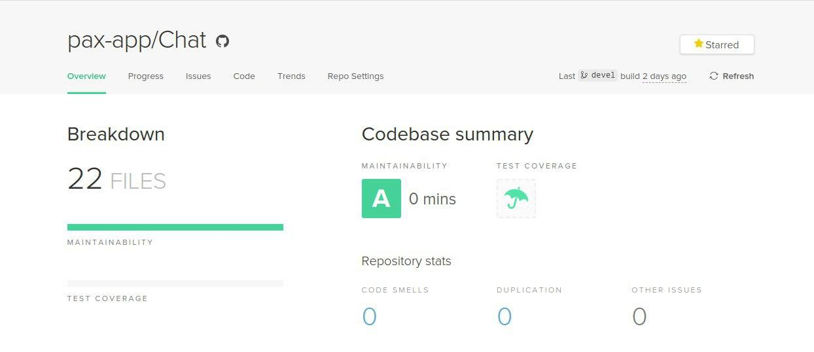

# [Chat](https://github.com/pax-app/Chat)

O serviço de chat é responsável pelo gerênciamento das salas de chat entre o usuário e o provedor. Se encarrega da comunicação direta com a banco de dados de forma a inserir, consultar e deletar as informações. Provem _endpoints_ que permitem a comunicação entre o sistema.

## Singleton

O _Singleton_ foi usado na **Class Database** pois é de extrema importância que a instância de conexão seja única e acessível por todo os módulos do serviço que a importarem. O _JavaScript_ tem um jeito simples de fazer isso que é o _export default new ClasseDesejada()_ que faz com que o todas as vezes que essa instância for chamada, ela será a mesma em qualquer lugar.

Arquivo: [database/index.js](https://github.com/pax-app/Chat/blob/devel/src/database/index.js#L7)

Foi usado também para garantir que a instância do **Chat Controller** seja única, pois não é necessária várias instâncias dessa _controller_. Dessa forma, usando a estrutura do _JavaScript_ de _export default new ClasseDesejada()_, faz com que o todas as vezes que for dado o _import_ dessa _Controller_, será chamada a mesma instância em qualquer lugar.

Arquivo: [ChatController.js](https://github.com/pax-app/Chat/blob/devel/src/app/controllers/ChatController.js#L42)

### [⬅](docs/DS/dinamica-e-seminario-4-b/criacionais.md#singleton)

## Chain of Responsibility

O **Chat List** foi modelado sobre o _Chain of Responsibility_ para que possa ser feita a validação dos _schemas_ recebidos via requisição, atuando como um _middleware_. Caso a validação ocorra com sucesso ele chama a _controller_ responsável pela requisição.

Arquivos:

- [ChatList.js](https://github.com/pax-app/Chat/blob/devel/src/app/validators/ChatList.js#L3)
- [Routes.js](https://github.com/pax-app/Chat/blob/devel/src/routes.js#L9)

O **Chat Store** foi modelado sobre o _Chain of Responsibility_ foi implementado para que possa ser feita a validação dos _schema_ recebidos via requisição, atuando como um _middleware_. Caso a validação ocorra com sucesso ele chama a _controller_ responsável pela requisição.

Arquivo:

- [ChatStore.js](https://github.com/pax-app/Chat/blob/devel/src/app/validators/ChatStore.js#L3)
- [Routes.js](https://github.com/pax-app/Chat/blob/devel/src/routes.js#L10)

### [⬅](docs/DS/dinamica-e-seminario-4-b/comportamentais.md#chain-of-responsibility)

## Facade

O _Facade_ foi implementado de forma que os _routes_ fiquem com a responsabilidade de redirecionar as requisições para seus devidos tratadores (_middleware_) e para os suas funções principais (_controllers_).

Arquivo: [ChatStore.js](https://github.com/pax-app/Chat/blob/devel/src/routes.js#L7)

### [⬅](docs/DS/dinamica-e-seminario-4-b/estruturais.md#facade)

## Proxy

O _Proxy_ foi usado pela composição de objetos dentro da instância do _express_. Dessa maneira, importamos a forma pura do _express_ e, com base em **composição**, vamos adicionando novas funcionalidades a ele, fazendo com que essas adições sejam _middleware_ a nível de sistema.

Arquivo: [app.js](https://github.com/pax-app/Chat/blob/devel/src/app.js#L11)

### [⬅](docs/DS/dinamica-e-seminario-4-b/estruturais.md#proxy)

## Controle de Manutenabilidade

Antes da implementações fizemos uso da ferramenta _Code Climate_ para mensurar a manutenabilidade do código deste microsserviço.

Este resultado leva em conta fatores como:

- Quantidade de argumentos de uma função
- Complexidade lógica
- Tamanho do arquivo
- Replicação de código
- Complexidade de métodos
- Quantidade de métodos
- Tamanho dos métodos
- Estruturas com muitos _if_ e _switch_
- Retorno dos métodos
