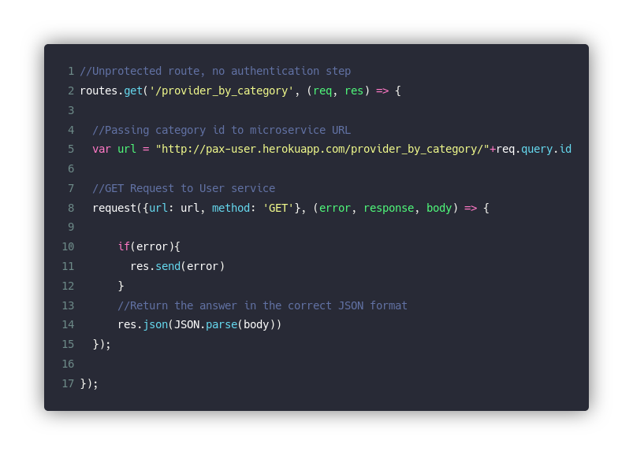
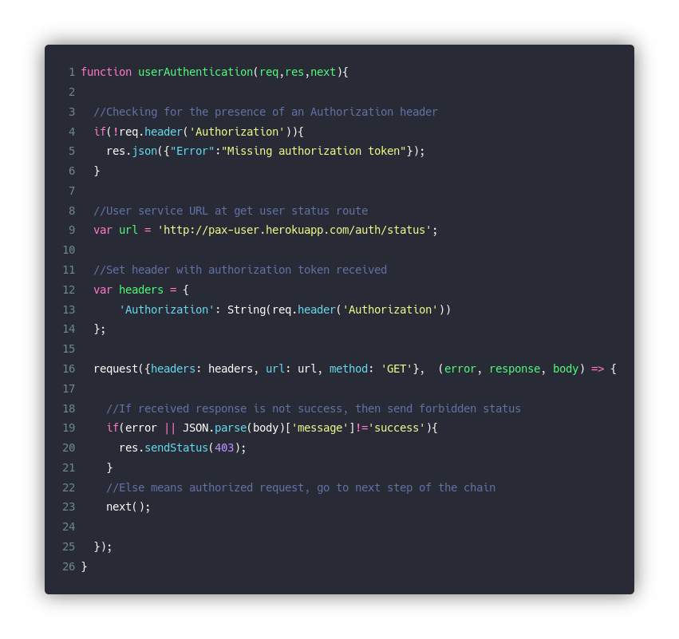
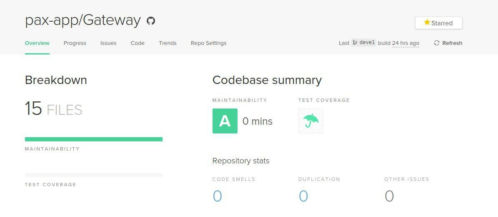

# [API Gateway](https://github.com/pax-app/Gateway)

Camada da aplicação responsável por redirecionar as requisições do front-end para o serviço responsável por resolve-la no back e devolver uma resposta na forma que o front está preparado para receber. Um dos artifícios de invensão pura para facilitar o gerenciamento de microsserviços.

## Histórico de Revisões

|    Data    | Versão |                   Descrição                   |  Autor(es)  |
| :--------: | :----: | :-------------------------------------------: | :---------: |
| 23/10/2019 |  0.1   |             Abertura do documento             | Marcos Nery |
| 24/10/2019 |  0.2   |               Adiciona Mediator               | Marcos Nery |
| 24/10/2019 |  1.0   | Adiciona Chain of Responsibility e singletone | Marcos Nery |

## Padrões utilizados:

### Mediator

Padrão central da Gateway, cuja definição é quase a mesma da definição do próprio serviço. Nesse caso utilizado para direcionar cada requisição ao microsserviço adequado para trata-la, além de cumprir nas rotas necessárias a tarefa de autenticação e formatação da resposta recebida do back-end. O Mediador aqui é de alto valor pois permite que o front não tenha que saber como se comunicar com cada microsserviço, além de simplificar a evolução/manutenção de toda a comunicação entre os módulos do sistema e fomentar o baixo acomplamento.

**Arquivo:** [routes.js](https://github.com/pax-app/Gateway/blob/devel/src/routes.js)

### [⬅](docs/DS/dinamica-e-seminario-4-b/comportamentais.md#mediator)

Aqui um outro padrão que poderia ser fácilmente visto é o faxada, no entanto, ao contrário do faxada o mediator é um atuador ativo na comunicação e faz mais do que simplesmente encaminhar os requests, se enquadrando melhor portanto no caso da Gateway.

### Chain of Responsibility

No tratamento dos requests vindos para a Gateway existem alguns passos para determinados casos precisam ser realizados, como autenticação e tratamento das informações recebidas, além do encaminhamento do request em sí. Dessa forma, o Chain of Responsibility é utilizado para que quando necessário essas funções adicionais possam realizar esse tratamento adicional necessário, com uma ordem controlada de ações e ajudando a manter o princípio da responsabilidade singular

Aqui podemos ver uma parte do código de uma determinada rota que define a cadeia de funções pela qual a requisição passará.

Já Aqui podemos ver uma das funções contidas na cadeia, ela trata do que lhe é responsabilidade e então chama a próxima

**Arquivo:** [routes.js](https://github.com/pax-app/Gateway/blob/devel/src/routes.js)

Outros patterns que poderiam ser utilizados nesse caso são o Decorator, Strategy e o Template Method. Porém, o que mais combina com o contexto é o Chain of Responsibility, pois permite que cada função cumpra apenas com o que é de sua responsabilidade, o que em alguns casos pode ser nada, e então chame a próxima função a atuar até que a requisição seja tratada, dinamismo que os outros padrões não trariam.

### [⬅](docs/DS/dinamica-e-seminario-4-b/comportamentais.md#chain-of-responsibility)

### Singleton

No contexto da Gateway, construída em Node, o singleton é utilizado para trabalhar com os módulos adicionais, garantindo que apenas uma instância dele seja criada

**Arquivo:** [routes.js](https://github.com/pax-app/Gateway/blob/devel/src/routes.js)

### [⬅](docs/DS/dinamica-e-seminario-4-b/criacionais.md#singleton)

## Controle de Manutenabilidade

Esse microsserviço foi modelado desde o início com a aplicação desses padrões, dessa forma, é possível ver que o _Code Climate_ aponta uma boa manutenabilidade.  

Este resultado leva em conta fatores como:

- Quantidade de argumentos de uma função
- Complexidade lógica
- Tamanho do arquivo
- Replicação de código
- Complexidade de métodos
- Quantidade de métodos
- Tamanho dos métodos
- Estruturas com muitos _if_ e _switch_
- Retorno dos métodos
