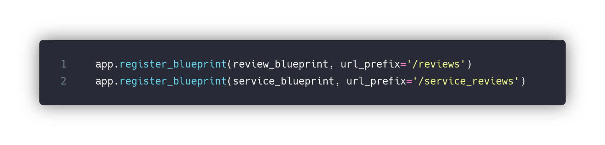
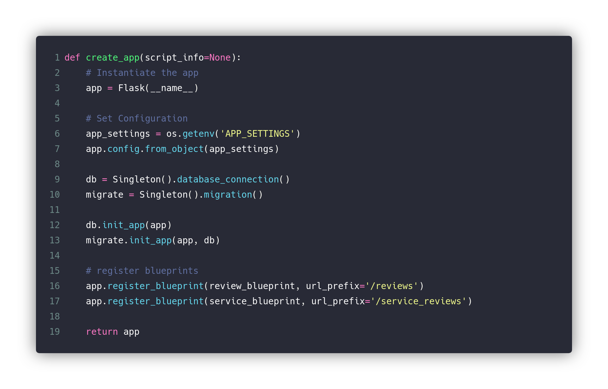
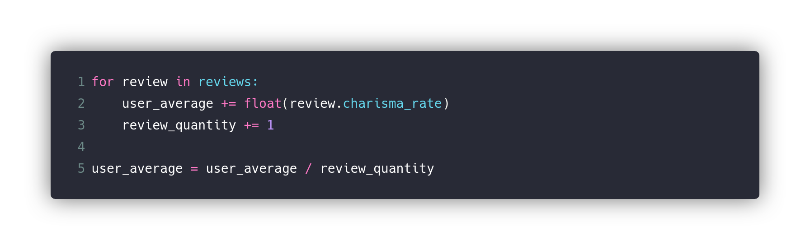
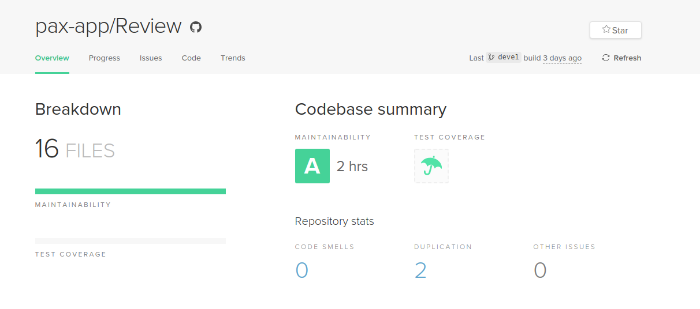

# [Review](https://github.com/pax-app/Review)

Microsserviço responsável pelos contratos cliente-prestador.

## Histórico de Revisões

|    Data    | Versão |      Descrição       |  Autor(es)  |
| :--------: | :----: | :------------------: | :---------: |
| 12/11/2019 |  1.0   | Criação do documento | Lucas Dutra |

## Padrões usados

### Facade

O padrão de faixada é implementado por padrão em uma ferramenta do _Micro-Framework_ _Flask_ chamada _Blueprint_. Isso acontece pois, essa estrutura, tem como papel destribuir para as rotas uma _URL_ base e ao mesmo tempo, ao instanciá-la, cria-se um vínculo da rota que faz uso dessa _Blueprint_ com todas as outras que implementam ela.

Arquivo: [init.py](https://github.com/pax-app/Review/blob/devel/project/__init__.py)

### [⬅](docs/DS/dinamica-e-seminario-4-b/estruturais.md#facade)

### Factory method

O Application Factory, é uma evolução do design _Pattern Factory_, sendo essa evolução proposta em plataformas emergentes orientadas à convenção, e adaptada à tecnologia de Micro-framework _Flask_. Por um lado é um padrão emergente, mas por outro tem em sua base o original conceito de fábrica do padrão de projeto GoF.

Este padrão é aplicado na criação da instância de um _app_ proveniente da biblioteca padrão do _Flask_.

Arquivo: [init.py](https://github.com/pax-app/Review/blob/devel/project/__init__.py)

### [⬅](docs/DS/dinamica-e-seminario-4-b/criacionais.md#factory-method)

### Iterator

Os iterators, por mais que sua implementação purista não esteja presente, a abstração feita pela linguagem de programação _Python_ atráves dos loops como _for_, _while_, está implentada no serviço de Review.

A aplicação deste padrão é dada no ato de percorrer listas de dicionários para calcular, posteriormente, a média das avaliações de um usuário ou prestador de serviço.

Arquivo: [views.py](https://github.com/pax-app/Review/blob/devel/project/api/views.py#L54)

### [⬅](docs/DS/dinamica-e-seminario-4-b/comportamentais.md#iterator)

### Singleton

O Singleton foi utilizado para garantirmos a instância única da aplicação com o banco de dados.

Arquivo: [database_singleton.py](https://github.com/pax-app/Review/blob/devel/database_singleton.py)

### [⬅](docs/DS/dinamica-e-seminario-4-b/criacionais.md#singleton)

## Controle de Manutenabilidade

Esse microsserviço foi modelado desde o início com a aplicação desses padrões, dessa forma, é possível ver que o _Code Climate_ aponta uma boa manutenabilidade.

Este resultado leva em conta fatores como:

- Quantidade de argumentos de uma função
- Complexidade lógica
- Tamanho do arquivo
- Replicação de código
- Complexidade de métodos
- Quantidade de métodos
- Tamanho dos métodos
- Estruturas com muitos _if_ e _switch_
- Retorno dos métodos
