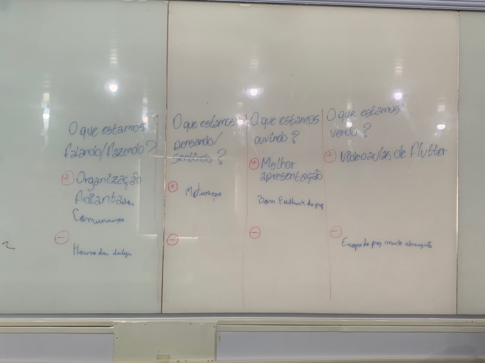

# Revisão Sprint 01

Trabalho muito satisfatório no qual foram entregues todas as issues bem antes do prazo definido, fato dado pelo <i>seminário 1</i> que estava marcado no calendário da disciplina e ocorreu na sexta-feira (23/08/2019). Todos os artefatos foram produzidos com qualidade e começaram a delimitar o escopo de atuação do projeto, fato ressaltado pela Profesora Milene durante a apresentação.

<i>Sprint</i> marcada por definições de escopo, para ter um direcionamento unificado e um guia claro de desenvolvimento, e no começo do processo de levantamento de requisitos, no qual algumas funcionalidades já foram levantadas, em cima de feedback de <i>stakeholders</i> (<a href="https://2019-2-arquitetura-e-desenho.github.io/Wiki/#/docs/DS/dinamica-e-seminario-1/AnaliseQuestionario">questionário</a>, <a href="https://2019-2-arquitetura-e-desenho.github.io/Wiki/#/docs/DS/dinamica-e-seminario-1/Entrevista">entrevistas</a>, time de desenvolvimento), e do <i>oceano azul</i>, documento que buscou diferenciar a aplicação dos concorrentes e inovar no meio de atuação.

## Fechamento da Sprint 01    

| _Issue_ | _Status_ | Pontos |
| :-----: | :------: | :----: |
| Análise do questionário | Concluído | 3 |
| Versão 2.0 do Rich Picture gerall | Concluído  | 3 |
| Rich Picture da visão do prestador de serviços | Concluído  | 3 |
| Rich Picture da visão do contratante de serviços | Concluído  | 3 |
| Organizar o brainstorming realizado em sala | Concluído  | 2 |
| Unificar todos os 5W2H | Concluído  | 1 |
| Organizar documentos na Wiki | Concluído  | 1 |
| Documento de definição de projeto | Concluído  | 3 |
| Oceano Azul | Concluído  | 2 |
| Analise de Sentimentos | Concluído  | 1 |
| Documento de Sprint Review e Sprint Planning | Concluído  | 1 |
| Criar Código de Contribuição | Concluído | 1 |
| Infográfico | Concluído  | 2 |
| Melhoria do Benchmarking | Concluído  | 2 |
| Brainstorming de ideias para o aplicativo | Concluído  | 2 |
| Documentação sprint 1 | Concluído | 1 |

Pontos Planejados Concluídos: 30

Pontos de Dívida Concluídos:  0   

Pontos Não Agregados: 1

## Riscos    

Riscos encontrados durante a sprint.  

| Risco | Prevenção | Ação  |
| :---: | :---: | :---: |
| Ter dois aplicativos por conta de usuários com funções diferentes | Definição de escopo | Conversar com o time e a professora para ter um direcionamento | 

# Retrospectiva

Com as percepções do time foram levantadas vários pontos positivos em relação ao trabalho do time, aos feedbacks da professora Milene e o andamento do projeto. Os dois pontos negativos levantados foram: a questão do horário das *Dailies*, que foi resolvido prontamente, e a questão do escopo muito abrangente que direcionou o planejamento da sprint seguinte.

A metodologia usada para tais feedbacks foi o quadro de empatia: alguns pontos foram levantados para analisar aspectos positivos e negativos, e, dessa forma, pedido aos membros para que dessem sua opinião indo ao quadro para poder escrever. O quadro produzido está logo abaixo. Por conta da falta de legibilidade de alguns tópicos, os pontos elencado foram transcritos para os tópicos abaixo.

## Pontos Positivos

  - Organização
  - Adiantados
  - Comunicação
  - Motivação do time
  - Melhor apresentação da turma
  - Bom feedback da professora
  - Membros vendo videoaulas de Flutter
  
## Pontos Negativos

  - Horário da Daily
  - Escopo muito grande do projeto

## Quadro de Sentimentos

Foram mapeados os sentimentos dos membros do time, a produtividade individual e a correlação entre as mesmas. A partir dos resultados gerados foi possível observar que o time teve uma alta produtividade, dado que os trabalhos começaram duas semanas antes do semestre letivo. 

Analisando a correlação entre sentimentos e produtividade, mesmo nos dias que não os membros estavam bem, continuaram trabalhando e conseguiram entregar suas tarefas. O humor do time melhorou quando todas as tarefas haviam sido entregues. Os gráficos gerados estão elencados abaixo.

<iframe src="https://docs.google.com/spreadsheets/d/e/2PACX-1vTCi50PjVIcno1S4pHK7rwji2MFbxJF53iYGnTs7WUNLNvE27HHLNfFlsCh3wiNMZvseopMCvagD3-I/pubchart?oid=238042475&format=interactive" width="100%" height="700px"></iframe>

<iframe src="https://docs.google.com/spreadsheets/d/e/2PACX-1vQkmreugxEeCvz7vA6DvWdZPITI3DHEceQe1YxgnDS8PCFgB7ZXbUJh--b5Sfm1KVFoWPPCRoqAnWgp/pubchart?oid=595382317&format=interactive" width="100%" height="700px"></iframe>

<iframe src="https://docs.google.com/spreadsheets/d/e/2PACX-1vTQc0fUk1XPc1xZp0cgnfcYU5CT0Do2hNvgCCW8HrlH4QBHtrLE7vOPHEFylxwO3Zwxe3zAhnpgugnh/pubchart?oid=1244284395&format=interactive" width="100%" height="700px"></iframe>

*Autor:* **[Rogério Júnior](https://github.com/rogerioo)**