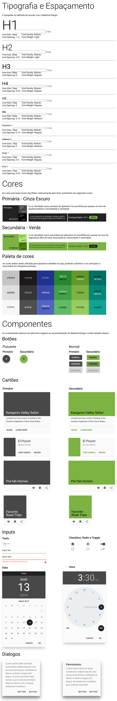

# Guia de Estilo

O guia de estilo serve como um guia visual e ajuda a manter o projeto consistente e coeso. Isso oferece um ponto de partida flexível para ajudar a definir como um estilo visual será aplicado no aplicativo, incluindo interfaces de usuário.

## Histórico de Revisões

|    Data    | Versão |                Descrição                 |   Autor(es)   |
| :--------: | :----: | :--------------------------------------: | :-----------: |
| 22/08/2019 |  1.0   | Adicionado V1 do guia de estilo |  Gabriel Albino e Fabiana Ribas  |

## Documento 
